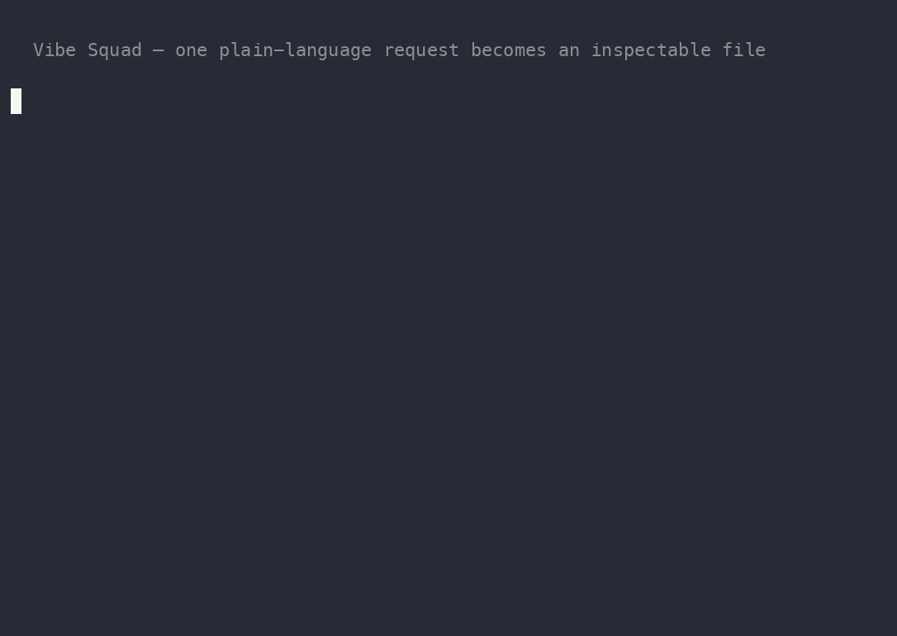
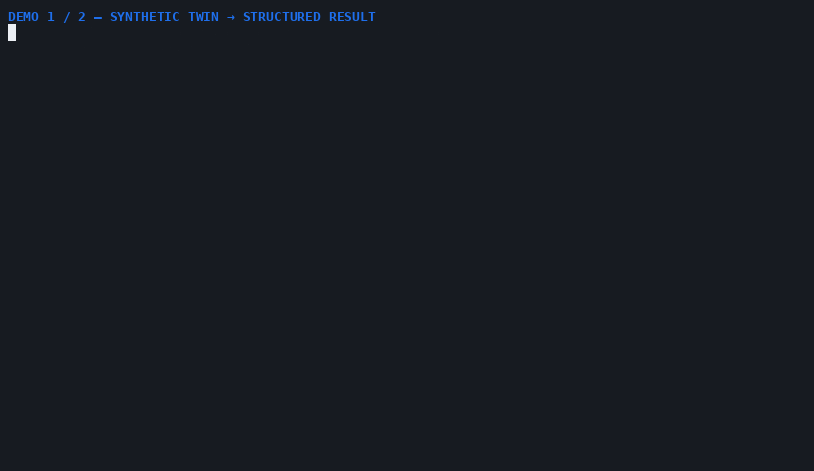

<p align="center">
  
</p>

<h1 align="center">Vibe Squad</h1>

<p align="center"><b>Route each job to the model family that fits it. Hold risky results for a different family to review.</b></p>

Vibe Squad is a local, inspectable control plane for Claude, Codex, Gemini, and Kimi. One coordinator turns a plain-language goal into scoped Markdown work, routes each specialist by capability instead of round-robin, and keeps the result visible as files.

For qualifying work, the authoring lane cannot declare itself finished: the runtime holds the result at `review-required` until Chrono receives a separate cross-family review and explicitly settles it.

<p align="center">
  <a href="https://github.com/mtarcure/claude-vibe-squad/actions/workflows/squad-validate.yml"></a>
  
  
  
  
  
</p>

> **The short version:** Codex builds. Claude reasons and reviews. Gemini handles design and content work. Kimi is a gated throughput lane for approved low-risk bulk passes. Chrono coordinates the handoffs, and the repository keeps the receipts.

---

## What stops the authoring model from grading its own homework?

Vibe Squad separates **execution**, **review**, and **settlement**.

```text
operator request
  → scoped task packet + declared write scope
  → best-fit specialist and provider lane
  → result artifact + completion envelope
  → mandatory-review result held at review-required
  → Chrono dispatches a different-family reviewer
  → review response lands
  → Chrono explicitly settles the result
```

<p align="center">
  
</p>

The runtime enforces the hold and settlement state. It does **not** silently auto-launch a reviewer or infer who has verdict authority; Chrono coordinates that separate dispatch. Refusals, timeouts, missing tools, dissent, and incomplete reviews stay visible instead of being rewritten as success.

<p align="center">
  
</p>

That is the central systems claim: **the model that produced a risky artifact does not get the last word.**

---

## Route by fit, not round-robin

The canonical registry assigns every specialist a primary lane, backup, escalation path, reviewer, safety floor, tool requirements, and policy metadata. The mailbox folder never chooses the model.

<p align="center">
  
</p>

| Provider lane | Best-fit work in the registry | Honest boundary |
|---|---|---|
| **GPT/Codex** | Implementation, tests, refactors, PoC mechanics, runtime and graphics engineering | Builds and verifies code; higher-risk results still require independent review and operator gates. |
| **Claude** | Architecture, planning, judgment, security reasoning, research synthesis, editorial review | The primary reasoning and review family; reviewer dispatch remains coordinator-triggered. |
| **Gemini** | Design, content, visual and media direction, accessibility, search-oriented work | Routes the creative workflow; the actual generator or connector is credited separately. |
| **Kimi** | Approved low-risk bulk and mechanical throughput | Throughput-only, with zero primary specialist roles; not a judgment or long-context research primary. |

Four persistent lanes are visible in one tmux control room, but they are not treated as interchangeable. Capability fit, lane-specific tools, safety metadata, and review independence determine the route.

Browse the generated [routing map](docs/routing-map.html) or inspect the canonical [specialist runtime map](shared/specialist-runtime-map.tsv).

---

## Mode → Capability → Protocol is shipped

Vibe Squad does not stop at a role catalog. A mode names the operator-approved workflow, a capability card describes a recognizable outcome inside that workflow, and a shared protocol makes the execution contract inspectable.

```text
operator intent
  → mode
    → capability card
      → S0–S7 protocol
        → specialists + lane-qualified tools + evidence + gates
```

The repository ships **27 capability cards across six families**. Every card is a Markdown registry file under [`shared/capabilities/`](shared/capabilities/), every mode file has a `## Capabilities` index, and every card instantiates the same S0–S7 skeleton.

| Family | Cards | Current state mix | Examples |
|---|---:|---|---|
| **Project** | 8 | 6 `live` · 2 `needs_tool` | Web apps, APIs, data pipelines, AI apps, platforms, systems, smart contracts, self-extension |
| **Bounty** | 4 | 3 `live` · 1 `needs_tool` | Web/API, AI systems, smart contracts, binaries and firmware |
| **Content** | 6 | 3 `live` · 3 `degraded-blueprint` | Editorial, campaigns, search, images, video, audio |
| **Research** | 3 | 3 `live` | Investigation, extraction, learning plans |
| **Outreach** | 1 | 1 `live` | Prospecting and draft outreach |
| **Maintenance** | 5 | 5 `live` | Repo health, releases, harnesses, memory, personal operations |
| **Total** | **27** | **21 `live` · 3 `needs_tool` · 3 `degraded-blueprint`** | **27/27 pass the validator** |

Incident and triage remain mode-level workflows with zero cards. **Operations** is a display family spanning incident, maintenance, and triage—not a hidden seventh mode.

### One shared execution spine

| Stage | Contract |
|---|---|
| **S0 — Intake** | Capture the requested outcome, scope, authority, and constraints. |
| **S1 — Frame** | Identify evidence needs, unknowns, costs, and tool availability. |
| **S2 — Design** | Choose specialists, lanes, overlays, and acceptance checks. |
| **S3 — Produce** | Create the bounded implementation, analysis, draft, or blueprint. |
| **S4 — Verify** | Run the card's deterministic checks and preserve the evidence. |
| **S5 — Review / Gate** | Apply independent review, authorization, privacy, or release gates. |
| **S6 — Ship** | Deliver the artifact through the declared, approved boundary. |
| **S7 — Capture** | Preserve durable results, gaps, provenance, and follow-up state. |

Cards specialize this spine without inventing a new workflow language each time. Panels and loop operators remain execution mechanisms, not capabilities.

### The complete capability catalog

<details>
<summary><b>Browse all 27 cards and their machine-checked state</b></summary>

#### Project — 8

| Capability | State |
|---|---|
| [Web application](shared/capabilities/project/web-app.md) | `needs_tool` |
| [Backend service / API](shared/capabilities/project/backend-service-api.md) | `live` |
| [Data pipeline](shared/capabilities/project/data-pipeline.md) | `live` |
| [AI / LLM application](shared/capabilities/project/ai-llm-application.md) | `live` |
| [Platform / release](shared/capabilities/project/platform-release.md) | `live` |
| [Systems / low-level](shared/capabilities/project/systems-low-level.md) | `needs_tool` |
| [Smart-contract / web3 build](shared/capabilities/project/smart-contract-web3.md) | `live` |
| [Self-extension — agents and tooling](shared/capabilities/project/self-extension-agent-tooling.md) | `live` |

#### Bounty — 4

| Capability | State |
|---|---|
| [Web API / HTTP-surface research](shared/capabilities/bounty/web-api-saas.md) | `live` |
| [LLM / AI-system research](shared/capabilities/bounty/ai-llm-system.md) | `live` |
| [Smart-contract / web3 research](shared/capabilities/bounty/smart-contract-web3.md) | `live` |
| [Binary / malware / firmware research](shared/capabilities/bounty/binary-firmware.md) | `needs_tool` |

#### Content — 6

| Capability | State |
|---|---|
| [Editorial / technical longform](shared/capabilities/content/editorial-longform.md) | `live` |
| [Marketing campaign](shared/capabilities/content/marketing-campaign.md) | `live` |
| [Search / discoverability](shared/capabilities/content/search-discoverability.md) | `live` |
| [Image asset generation](shared/capabilities/content/image.md) | `degraded-blueprint` |
| [Video / motion asset generation](shared/capabilities/content/video.md) | `degraded-blueprint` |
| [Audio assets](shared/capabilities/content/audio-assets.md) | `degraded-blueprint` |

#### Research — 3

| Capability | State |
|---|---|
| [Multi-source investigation and synthesis](shared/capabilities/research/investigation-synthesis.md) | `live` |
| [Data extraction and dataset wrangling](shared/capabilities/research/data-extraction-dataset.md) | `live` |
| [Learning and study](shared/capabilities/research/learning-study.md) | `live` |

#### Outreach — 1

| Capability | State |
|---|---|
| [Prospecting / outreach](shared/capabilities/outreach/prospecting-outreach.md) | `live` |

#### Maintenance — 5

| Capability | State |
|---|---|
| [Environment / repo health](shared/capabilities/maintenance/environment-repo-health.md) | `live` |
| [Dependency / release integrity](shared/capabilities/maintenance/dependency-release-integrity.md) | `live` |
| [Harness audit / compatibility](shared/capabilities/maintenance/harness-audit-compatibility.md) | `live` |
| [Memory / vault hygiene](shared/capabilities/maintenance/memory-vault-hygiene.md) | `live` |
| [Personal operations](shared/capabilities/maintenance/personal-operations.md) | `live` |

</details>

---

## Honesty is infrastructure, not a disclaimer

Capability claims are mechanically constrained by [`bin/validate-capabilities.sh`](bin/validate-capabilities.sh) and the typed [`skill-tool-registry.tsv`](shared/registries/skill-tool-registry.tsv).

The validator checks card structure, specialists, skills, tools, lanes, costs, gates, and state. It derives the strongest state the verified toolchain can support and rejects a card that claims something more generous. A card may remain more conservative—for example, media cards stay `degraded-blueprint` until their paid, credentialed render routes are safe to promise from the selected lane.

The state vocabulary is deliberately small:

| State | Meaning |
|---|---|
| `live` | The declared core path is supported by verified tools on an eligible lane. |
| `needs_tool` | A load-bearing tool is missing, unverified, or unavailable on the required lane. |
| `degraded-blueprint` | The workflow can produce a complete specification or blueprint, but cannot honestly promise the final provider-backed artifact on that route. |

The current registry passes **27/27**. That number is not a hand-maintained badge; it comes from the validator joining every card to the typed registry.

### Why validation still needs independent review

Every capability family was authored by one model family and reviewed by another. That cross-family pass caught real over-claims—including a card whose prose depended on a tool that was absent from its typed tool declarations—and exposed a false-pass hole in the validator itself.

The lesson became part of the design:

```text
mechanical validation catches schema and registry drift
  +
independent review catches semantic and prose-level over-claims
  =
capability states worth trusting
```

Neither check is presented as sufficient alone.

### Media claims name the real route

Media production uses the [`chrono-media-studio`](plugins/chrono-media-studio/) wrappers:

- images use `generate_image` — its xAI/Grok image route is verified working in the reference deployment, while the public `content/image` capability stays `degraded-blueprint` pending the Higgsfield wrapper reconciliation;
- video uses the `generate_video` wrapper;
- audio uses `generate_audio`, with ElevenLabs child tooling on the Claude host lane.

Raw `higgsfield__*` tools are not claimed as live. Paid or credentialed generation requires budget, rate-limit, and operator gates. When the selected lane cannot render, the result is a typed blueprint or `needs_tool`—not fabricated success.

### Built now; provider gap closure is roadmap

The card registry, mode indexes, shared protocol, typed tool registry, state derivation, and validator are shipped. Wiring additional browser, design, deployment, binary-analysis, and provider-specific tools is future gap-closure work. The roadmap may turn more cards live; the README does not pre-announce those routes as working.

---

## Engineering you can inspect

### Files are the interface

The control plane is Markdown-first: a task packet declares the specialist, lane, write scope, review requirement, and terminal artifact. The result returns through an outbox envelope with a canonical status.

<p align="center">
  
</p>

That interface supports concrete failure and coordination semantics:

- same-directory temporary publication, file `fsync`, and atomic rename;
- lock-serialized reconciliation and a canonical terminal-state vocabulary;
- overlap detection for declared write scopes;
- single-writer panel synthesis;
- explicit capability gaps, refusals, timeouts, and review holds;
- durable artifacts that can be diffed, archived, audited, or replayed.

Declared write scopes are workflow boundaries, not OS sandboxes. Operator approvals remain explicit policy gates.

### Memory-backed, private, and rebuildable

[Chrono Vault](plugins/chrono-vault/README.md) keeps private Markdown notes outside the public worktree. A disposable FTS5/BM25 index can be rebuilt from those notes; content hashes, provenance, lifecycle state, and sensitivity clearance travel with recall. Recalled text is quoted as untrusted evidence, not treated as instructions.

Completion capture and usage feedback make the system memory-backed. Feedback does not silently retrain models or automatically change ranking.

### A system that can extend itself

Vibe Squad includes four narrow `chrono-*` plugin implementations:

- [`chrono-vault`](plugins/chrono-vault/) — private Markdown memory and lexical recall;
- [`chrono-research-arsenal`](plugins/chrono-research-arsenal/) — research-provider wrappers;
- [`chrono-media-studio`](plugins/chrono-media-studio/) — image, video, and audio entry points;
- [`chrono-recon`](plugins/chrono-recon/) — passive DNS, WHOIS, certificate, archive, and repository-search helpers.

The Project capability for [self-extension](shared/capabilities/project/self-extension-agent-tooling.md) applies the same S0–S7 contract to MCP servers, plugins, skills, agents, and adapters. Four repository implementations prove the pattern; they do not imply every external provider is live on every lane.

---

## Quick start after prerequisites

You need macOS, tmux, `fswatch`, `jq`, `curl`, Python 3.13, and logged-in Claude Code, Codex, Gemini, and Kimi CLIs.

```bash
git clone https://github.com/mtarcure/claude-vibe-squad.git
cd claude-vibe-squad
bin/squad doctor
bin/squad up --safe
```

That opens a persistent control room:

```text
Ctrl-b 0  chrono       Ctrl-b 3  gemini
Ctrl-b 1  gpt-codex    Ctrl-b 4  kimi
Ctrl-b 2  claude       Ctrl-b 5  watchers/status
Ctrl-b d  detach — the lanes keep running
```

Ask Chrono for work in plain language. Use the lifecycle commands when needed:

```bash
bin/squad status
bin/squad doctor
bin/squad stop
```

> [!IMPORTANT]
> Start with `--safe`. The autonomous daily-driver profile launches provider CLIs with broader bypass/yolo-style permissions after a warning and health check. Review scopes, credentials, and the workflow before using it.

---

## Case study: a differential impact-verification lab

<p align="center">
  
</p>

[`moat/`](moat/README.md) is a **differential impact-verification lab, not an exploit launcher**. It turns a human-reviewed invariant into a reproducible JavaScript/TypeScript vulnerable-vs-patched experiment and emits an evidence-referenced `PASS`, `FAIL`, or `INCONCLUSIVE` result.

The public toolkit includes:

- JavaScript/TypeScript AST boundary scanning;
- patch and diff ingestion with human-reviewed invariant annotations;
- a vulnerable/patched synthetic twin with property-state fuzzing, coverage, and controls;
- a hardened Docker runner with no network, a read-only root, a non-root user, resource limits, and negative egress canaries.

The isolated runner fails closed at its execution boundary: a mandatory preflight must prove the loopback control reachable while external IPv4, IPv6, DNS, proxy, host-gateway, and TCP/TLS paths are blocked, or the experiment aborts. The tracked Tier-A pre-commit scanner is an opt-in developer convenience and fails open if Node or its scanner is unavailable; CI remains the shared validation boundary.

Real targets, corpora, findings, and payloads stay in private operational state. The public repository ships the generic JS/TS engine and synthetic reference workload. It does not claim smart-contract adapters, cryptographically signed results, or universal fail-closed behavior.

---

## Six workflow families, eight mode contracts

Project work is the broadest path: define the result, design it, split implementation by specialist, test it, review it, package it, and hand it off. Bounty is one workflow family—not the product identity.

| Family | Mode contracts | Capability cards | What it coordinates |
|---|---|---:|---|
| **Project** | [`project`](shared/modes/project.md) | 8 | End-to-end software, platforms, AI applications, systems, smart contracts, and self-extension |
| **Bounty** | [`bounty`](shared/modes/bounty.md) | 4 | Authorized recon, analysis, PoCs, impact validation, reporting, and submission holds |
| **Content** | [`content`](shared/modes/content.md) | 6 | Editorial, campaigns, search, images, video, and audio |
| **Research** | [`research`](shared/modes/research.md) | 3 | Investigation, synthesis, data extraction, datasets, and learning plans |
| **Outreach** | [`outreach`](shared/modes/outreach.md) | 1 | Prospect discovery, qualification, privacy review, offers, drafts, and digests |
| **Operations** | [`incident`](shared/modes/incident.md) · [`maintenance`](shared/modes/maintenance.md) · [`triage`](shared/modes/triage.md) | 5 | Reliability, security incidents, repository health, release integrity, memory, harnesses, and local personal operations |

Triage is the Operations front door: its result includes the selected mode, capability, capability state, cost exposure, and uncertainty. Incident and triage have no capability cards of their own; maintenance owns the five Operations cards.

Every mode index links to its cards and prints validator-derived state so operators can see the current route before dispatch.

---

## 69 validated specialist routes

The canonical registry contains 69 specialist routes across implementation, product, content, media, security, operations, review, QA, and research. “Validated route” means the role, adapter, lane, policy, and packet path resolve; it does not promise that every external provider tool is live on every lane.

| Area | Representative specialists |
|---|---|
| End-to-end software | `product-manager`, `architect`, `frontend-engineer`, `backend-engineer`, `database-engineer`, `devops-engineer` |
| Quality and review | `test-engineer`, `code-reviewer`, `performance-optimizer`, `accessibility-engineer`, `skeptic` |
| AI and self-extension | `ai-engineer`, `prompt-engineer`, `harness-optimizer`, `agentops` |
| Content and media | `editor`, `copywriter`, `image-designer`, `video-director`, `sound-designer`, `voice-narrator` |
| Security | `threat-modeler`, `security-analyst`, `smart-contract-engineer`, `reverse-engineer`, `impact-validator` |
| Operations and research | `site-reliability-engineer`, `incident-responder`, `memory-curator`, `research`, `data-extraction-engineer` |

See the [interactive routing map](docs/routing-map.html), the [canonical TSV](shared/specialist-runtime-map.tsv), and the specialist briefs under [`departments/`](departments/).

---

## Optional bounded panels

<p align="center">
  
</p>

Panels collect 2–3 specialist perspectives concurrently inside Claude or Codex. They use quorum, deadlines, visible member states, and one accountable coordinator who owns the final artifact. Fan-out is Claude-enabled and Codex-gated; Gemini and Kimi are excluded because their subagents do not retain the required MCP surface.

Panels are not proof of four-family debate, and they are not independent review. Cross-family review is the separate held-and-settled path described at the top.

---

## Reviewed public distribution, private operational state

This repository is the complete runnable public distribution, not a mock. The maintainer operates from a private superset containing live mailboxes, operator configuration, memory, credentials, and target-specific data.

A deterministic export projects the public-safe tree and applies layered path, secret, private-identifier, and content gates before publication. The public history is intentionally retained; this process governs reviewed exports going forward rather than claiming a history rewrite.

Forkers can clone and operate this repository normally. Keep generated state, mailbox traffic, credentials, target data, and memory private. A second publication repository is optional; it is useful only if you also want a separately reviewed public projection.

See [`tools/export/`](tools/export/) for the projector, [`docs/private-config.md`](docs/private-config.md) for private configuration, and [`CONTRIBUTING.md`](CONTRIBUTING.md) for contribution mechanics.

---

## Shipped, gated, and next

| Surface | State | Boundary |
|---|---|---|
| tmux + Markdown dispatch | **Shipped** | Requires local authenticated provider CLIs. |
| 69-role registry and routing validation | **Shipped** | Route validation is distinct from live external-tool availability. |
| 27-card capability system | **Shipped** | Card state is registry-validated and can conservatively degrade. |
| capability validator + typed tool registry | **Shipped** | Mechanical validation complements, rather than replaces, cross-family review. |
| cross-family review | **Shipped hold + explicit settlement** | Chrono separately dispatches the reviewer; the runtime does not auto-launch one. |
| bounded panels | **Shipped, opt-in** | Claude and Codex only; collection is not review. |
| Chrono Vault | **Shipped** | Live notes and the vault root are intentionally off-repo. |
| four `chrono-*` plugins | **Shipped implementations** | Exact tools remain lane- and credential-aware. |
| moat differential lab | **Shipped JS/TS synthetic path** | Real targets remain private; no smart-contract or signing claim. |
| more provider and local-tool routes | **Roadmap** | Gap closure must update the registry and re-derive affected card states. |
| automatic failover | **Implemented, dormant** | Not a default user-facing capability. |

---

## Repository map

| Path | Purpose |
|---|---|
| `bin/squad`, `bin/launch-squad.sh` | Lifecycle CLI and six-window tmux launcher |
| `scripts/send-task.sh`, `bin/send-task.sh` | Packet generation, validation, delivery, and lane nudge |
| `shared/specialist-runtime-map.tsv` | Canonical specialist routing data |
| `shared/registries/skill-tool-registry.tsv` | Typed skill and tool availability registry |
| `shared/routing.md`, `shared/protocol.md` | Routing, packet, lifecycle, and review contracts |
| `shared/modes/` | Eight mode contracts and their capability indexes |
| `shared/capabilities/` | Twenty-seven S0–S7 capability cards |
| `departments/*/specialists/` | Canonical specialist briefs |
| `plugins/` | Memory, research, media, and recon implementations |
| `moat/` | Differential impact-verification lab |
| `daemon/` | Optional FastAPI support service; not the dispatch spine |
| `docs/` | Architecture, runtime, specialist, and operating guides |

## Contributing

Start with [`CONTRIBUTING.md`](CONTRIBUTING.md). Architecture and operating guides live under [`docs/`](docs/), and [`docs/adding-a-specialist.md`](docs/adding-a-specialist.md) explains how to extend the role catalog.

## License

AGPL-3.0. See [`LICENSE`](LICENSE).
