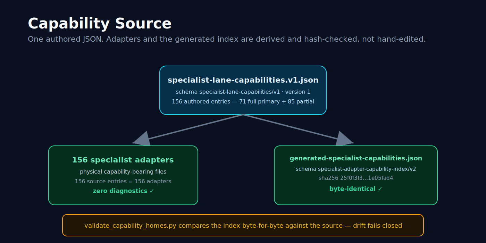
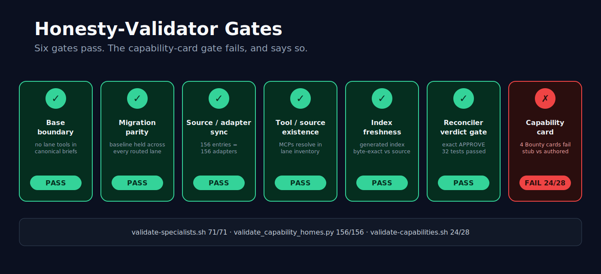
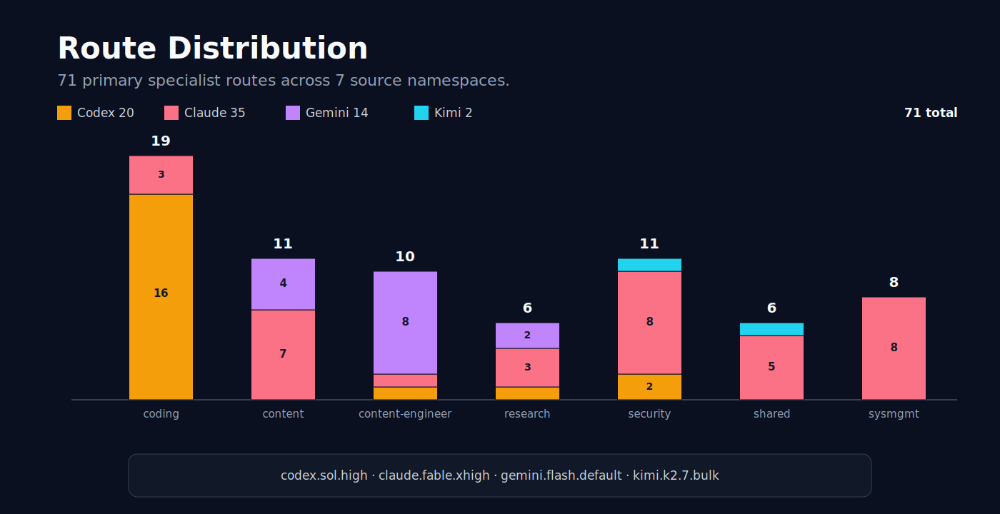

<p align="center">
  
</p>

<h1 align="center">Vibe Squad</h1>

<p align="center"><b>Route each job to the model family that fits it. Hold risky results for a different family to review.</b></p>

Vibe Squad is a local, inspectable control plane for Claude, Codex, Gemini, and Kimi. One coordinator turns a plain-language goal into scoped Markdown work, routes each specialist by capability instead of round-robin, and keeps the result visible as files.

For qualifying work, the authoring lane cannot declare itself finished: the runtime holds the result at `review-required` until Chrono receives a separate cross-family review and explicitly settles it.

<p align="center">
  <a href="https://github.com/mtarcure/claude-vibe-squad/actions/workflows/squad-validate.yml"></a>
  
  
  
  
  
</p>

> **The short version:** Codex builds. Claude reasons and reviews. Gemini handles design and content work. Kimi is a gated throughput lane, primary only for two narrowly scoped roles. Chrono coordinates the handoffs, and the repository keeps the receipts.

---

## What stops the authoring model from grading its own homework?

Vibe Squad separates **execution**, **review**, and **settlement**.

```text
operator request
  → scoped task packet + declared write scope
  → best-fit specialist and provider lane
  → result artifact + completion envelope
  → mandatory-review result held at review-required
  → Chrono dispatches a different-family reviewer
  → review response lands
  → Chrono explicitly settles the result
```

<p align="center">
  
</p>

The runtime enforces the hold and settlement state. It does **not** silently auto-launch a reviewer or infer who has verdict authority; Chrono coordinates that separate dispatch. Refusals, timeouts, missing tools, dissent, and incomplete reviews stay visible instead of being rewritten as success.

<p align="center">
  
</p>

That is the central systems claim: **the model that produced a risky artifact does not get the last word.** It is enforced by a machine gate, not a convention — see [Settlement needs an exact verdict](#settlement-needs-an-exact-verdict-not-a-vibe) below.

---

## Route by fit, not round-robin

The canonical registry assigns every specialist a primary lane, backup, escalation path, reviewer, safety floor, tool requirements, and policy metadata. The mailbox folder never chooses the model.

<p align="center">
  
</p>

| Provider lane | Best-fit work in the registry | Honest boundary |
|---|---|---|
| **GPT/Codex** | Implementation, tests, refactors, PoC mechanics, runtime and graphics engineering | Builds and verifies code; higher-risk results still require independent review and operator gates. |
| **Claude** | Architecture, planning, judgment, security reasoning, research synthesis, editorial review | The primary reasoning and review family; reviewer dispatch remains coordinator-triggered. |
| **Gemini** | Design, content, visual and media direction, accessibility, search-oriented work | Routes the creative workflow; the actual generator or connector is credited separately. |
| **Kimi** | Approved low-risk bulk and mechanical throughput, plus two narrow primary exceptions | Primary only for `experimental-attacker` and `summarizer`; everything else stays role/policy-gated, and its subagents can't hold MCP at all — a lead has to broker any tool access. Not a judgment or long-context research primary. |

Four persistent lanes are visible in one tmux control room, but they are not treated as interchangeable. Capability fit, lane-specific tools, safety metadata, and review independence determine the route.

Browse the generated [routing map](docs/routing-map.html) or inspect the canonical [specialist runtime map](shared/specialist-runtime-map.tsv).

### Four lanes, one real capability surface

The table above states intent; this is the audited inventory behind it. Counts come from `model-lanes/lane-capabilities.tsv`. "Declared MCP inventory" is not the same claim as "usable everywhere" — every lane inventory still lists a `chrono-kg` compatibility entry, but the typed [`skill-tool-registry.tsv`](shared/registries/skill-tool-registry.tsv) marks it retired and unavailable. Treat that entry as a stale label, not a live tool.

| Lane | Routes | Local/adapter surface | Child MCP behavior | Honest boundary |
|---|---:|---|---|---|
| `gpt-codex` | 20 | TOML specialists, `playwright` adapter tool, `repo-shell`, native subagents | `inherit-full`; no native grounding | Guarded security trio is staged, not live; metered provider calls still need budget/authorization. |
| `claude` | 35 | Markdown specialists, `playwright` adapter tool, `repo-shell`, native agents | `inherit-full`; no native grounding | Deep ultra-research stays probe-failed; guarded trio remains pending restart. |
| `gemini` | 14 | Markdown specialists, seven edit/shell/browser adapter tools, native agents | `inherit-configured-mcp`; Google Search grounding | Inherits configured MCPs, not the full controller surface; paid/provider actions stay gated. |
| `kimi` | 2 | YAML specialists, no adapter tools, native subagents | `lead-broker-only`; no grounding | No child MCP possession at all; not a general judgment lane. |

**What's actually wired versus staged, as of this audit:**

- **Firecrawl** is implemented behind [`chrono-research-arsenal`](plugins/chrono-research-arsenal/) as `firecrawl_scrape`, `firecrawl_crawl`, and `firecrawl_parse`. A tools/list handshake on Codex returned all three operations with a live key present; no metered provider call was made to produce that receipt, and the key value was never printed or logged.
- **Playwright and Chrome DevTools** carry current exit-0 probe receipts on Codex and Gemini, and Claude declares both from an MCP-list receipt on the same date. Kimi has neither — its subagents can't hold MCP, so browser work on that lane has to go through a lead broker.
- **The Trail of Bits guarded stack** (`guarded-semgrep`, `guarded-slither`, `guarded-solodit`) is declared on Claude and Codex security roles only, and only as `pending-restart-activation`. Its dedicated validator currently passes — three schemas reviewed, Solodit `activated-ready` — but activation still needs inherited credentials, a fail-closed Snyk preflight, a controlled squad restart, a fresh tools/list, and read-only fixture calls before it counts as live. Model Armor stays blocked on operator credentials.

---

## Mode → Capability → Protocol is shipped

Vibe Squad does not stop at a role catalog. A mode names the operator-approved workflow, a capability card describes a recognizable outcome inside that workflow, and a shared protocol makes the execution contract inspectable.

```text
operator intent
  → mode
    → capability card
      → S0–S7 protocol
        → specialists + lane-qualified tools + evidence + gates
```

The repository ships **28 capability cards across six families**. Every card is a Markdown registry file under [`shared/capabilities/`](shared/capabilities/), every mode file has a `## Capabilities` index, and every card instantiates the same S0–S7 skeleton.

| Family | Cards | Current state mix | Examples |
|---|---:|---|---|
| **Project** | 9 | 8 `live` · 1 `needs_tool` | Web apps, APIs, data pipelines, AI apps, platforms, systems, smart contracts, game production, self-extension |
| **Bounty** | 4 | 3 `live` · 1 `needs_tool` | Web/API, AI systems, smart contracts, binaries and firmware |
| **Content** | 6 | 6 `live` | Editorial, campaigns, search, images, video, audio |
| **Research** | 3 | 3 `live` | Investigation, extraction, learning plans |
| **Outreach** | 1 | 1 `live` | Prospecting and draft outreach |
| **Maintenance** | 5 | 5 `live` | Repo health, releases, harnesses, memory, personal operations |
| **Total** | **28** | **26 `live` · 2 `needs_tool` · 0 `degraded-blueprint`** | **24/28 pass the card validator (details below)** |

Incident and triage remain mode-level workflows with zero cards. **Operations** is a display family spanning incident, maintenance, and triage—not a hidden seventh mode.

### One shared execution spine

| Stage | Contract |
|---|---|
| **S0 — Intake** | Capture the requested outcome, scope, authority, and constraints. |
| **S1 — Frame** | Identify evidence needs, unknowns, costs, and tool availability. |
| **S2 — Design** | Choose specialists, lanes, overlays, and acceptance checks. |
| **S3 — Produce** | Create the bounded implementation, analysis, draft, or blueprint. |
| **S4 — Verify** | Run the card's deterministic checks and preserve the evidence. |
| **S5 — Review / Gate** | Apply independent review, authorization, privacy, or release gates. |
| **S6 — Ship** | Deliver the artifact through the declared, approved boundary. |
| **S7 — Capture** | Preserve durable results, gaps, provenance, and follow-up state. |

Cards specialize this spine without inventing a new workflow language each time. Panels and loop operators remain execution mechanisms, not capabilities.

### The complete capability catalog

<details>
<summary><b>Browse all 28 cards and their machine-checked state</b></summary>

#### Project — 9

| Capability | State |
|---|---|
| [Web application](shared/capabilities/project/web-app.md) | `live` |
| [Backend service / API](shared/capabilities/project/backend-service-api.md) | `live` |
| [Data pipeline](shared/capabilities/project/data-pipeline.md) | `live` |
| [AI / LLM application](shared/capabilities/project/ai-llm-application.md) | `live` |
| [Platform / release](shared/capabilities/project/platform-release.md) | `live` |
| [Systems / low-level](shared/capabilities/project/systems-low-level.md) | `needs_tool` |
| [Smart-contract / web3 build](shared/capabilities/project/smart-contract-web3.md) | `live` |
| [Game production (browser game)](shared/capabilities/project/game-production.md) | `live` |
| [Self-extension — agents and tooling](shared/capabilities/project/self-extension-agent-tooling.md) | `live` |

#### Bounty — 4

| Capability | State |
|---|---|
| [Web API / HTTP-surface research](shared/capabilities/bounty/web-api-saas.md) | `live` |
| [LLM / AI-system research](shared/capabilities/bounty/ai-llm-system.md) | `live` |
| [Smart-contract / web3 research](shared/capabilities/bounty/smart-contract-web3.md) | `live` |
| [Binary / malware / firmware research](shared/capabilities/bounty/binary-firmware.md) | `needs_tool` |

> All four Bounty cards currently **fail** `bin/validate-capabilities.sh` on a metadata-completeness check — `program-rubric-lookup` and/or `data-flow-trace` are declared `stub` where the validator requires `authored`. This is separate from the `live`/`needs_tool` state above, which is unaffected; it is a documented open repair, not a hidden one.

#### Content — 6

| Capability | State |
|---|---|
| [Editorial / technical longform](shared/capabilities/content/editorial-longform.md) | `live` |
| [Marketing campaign](shared/capabilities/content/marketing-campaign.md) | `live` |
| [Search / discoverability](shared/capabilities/content/search-discoverability.md) | `live` |
| [Image asset generation](shared/capabilities/content/image.md) | `live` |
| [Video / motion asset generation](shared/capabilities/content/video.md) | `live` |
| [Audio assets](shared/capabilities/content/audio-assets.md) | `live` |

#### Research — 3

| Capability | State |
|---|---|
| [Multi-source investigation and synthesis](shared/capabilities/research/investigation-synthesis.md) | `live` |
| [Data extraction and dataset wrangling](shared/capabilities/research/data-extraction-dataset.md) | `live` |
| [Learning and study](shared/capabilities/research/learning-study.md) | `live` |

#### Outreach — 1

| Capability | State |
|---|---|
| [Prospecting / outreach](shared/capabilities/outreach/prospecting-outreach.md) | `live` |

#### Maintenance — 5

| Capability | State |
|---|---|
| [Environment / repo health](shared/capabilities/maintenance/environment-repo-health.md) | `live` |
| [Dependency / release integrity](shared/capabilities/maintenance/dependency-release-integrity.md) | `live` |
| [Harness audit / compatibility](shared/capabilities/maintenance/harness-audit-compatibility.md) | `live` |
| [Memory / vault hygiene](shared/capabilities/maintenance/memory-vault-hygiene.md) | `live` |
| [Personal operations](shared/capabilities/maintenance/personal-operations.md) | `live` |

</details>

---

## Honesty is infrastructure, not a disclaimer

Two different systems both use the word "capability" here, and conflating them is exactly the kind of drift this project exists to catch:

1. **Capability cards** — the S0–S7 workflow blueprints for Project, Bounty, Content, and the rest, covered above. Checked by [`bin/validate-capabilities.sh`](bin/validate-capabilities.sh) against the typed [`skill-tool-registry.tsv`](shared/registries/skill-tool-registry.tsv).
2. **Specialist-lane capability ownership** — which tools and MCPs each specialist actually holds on each lane. Authored once, checked by a separate suite, described next.

They have separate validators and separate current results — one of them is red right now, and this README says so rather than rounding up.

The card validator checks card structure, specialists, skills, tools, lanes, costs, gates, and state. It derives the strongest state the verified toolchain can support and rejects a card that claims something more generous. A card may remain more conservative — for example, a card can stay `needs_tool` until its load-bearing route is verified from the selected lane.

The state vocabulary is deliberately small:

| State | Meaning |
|---|---|
| `live` | The declared core path is supported by verified tools on an eligible lane. |
| `needs_tool` | A load-bearing tool is missing, unverified, or unavailable on the required lane. |
| `degraded-blueprint` | The workflow can produce a complete specification or blueprint, but cannot honestly promise the final provider-backed artifact on that route. |

The current registry stands at **24/28**. That number is not a hand-maintained badge — it comes from the validator joining every card to the typed registry, and today it fails closed on four Bounty cards (see the catalog above) rather than being rounded up to green.

### One versioned source, everything else derived

<p align="center">
  
</p>

[`model-lanes/specialist-lane-capabilities.v1.json`](model-lanes/specialist-lane-capabilities.v1.json) is the single place specialist-lane capability ownership gets authored: 156 specialist/lane entries — 71 `full` primary entries (one per routed specialist) and 85 `partial` backup/escalation/review/throughput entries. Nothing else in this layer is independently hand-maintained:

- Every specialist lane adapter must physically match those same 156 entries — the validator checks source-to-adapter sync, not just presence.
- [`model-lanes/generated-specialist-capabilities.json`](model-lanes/generated-specialist-capabilities.json) (schema `specialist-adapter-capability-index/v2`) is regenerated from the source and pinned to it by a SHA-256 hash. The validator re-renders the index and diffs it byte-for-byte against the checked-in copy — drift fails the gate instead of quietly going stale.

Edit the one source file, regenerate, and the validator either confirms the derived files caught up or blocks the change. That is what "regen-safe" means here.

### The honesty-validator suite

<p align="center">
  
</p>

| Validator / gate | What it enforces | Current result |
|---|---|---|
| Specialist schema/routing | Registry shape, uniqueness, lane-policy foreign keys, the two explicit Kimi exceptions, safety/review/throughput/tool semantics | 71/71, exit 0, no warnings |
| Base boundary | Canonical specialist briefs can't declare lane-specific tools, skills, or MCPs — concrete access belongs in lane adapters | Zero diagnostics |
| Migration parity | The pinned pre-migration capability baseline is preserved across every routed lane | Zero diagnostics |
| Source/adapter sync | Exactly the routed specialist/lane pairs, `full` coverage on every primary, matching derived arrays | 156 source entries = 156 adapters, zero diagnostics |
| Tool/source existence | Declared MCPs/skills/tools must resolve in lane inventory, installed roots, or shell-qualified PATH | Zero diagnostics; pending items are tracked, not projected as live |
| Index freshness | Regenerates the derived index and diffs it byte-for-byte against the checked-in copy | Current, byte-identical |
| Reconciler verdict gate | Holds cross-family-required results, requires reviewer family ≠ author family, requires an exact structured `APPROVE` before settlement | 32 focused tests passing |
| Capability-card validator | Card structure, typed skills/tools, lanes, cost/gates, claimed vs. derived state | **24/28 pass** — four Bounty cards fail on a `stub`-vs-`authored` skill-declaration mismatch |

The last row is left in on purpose: this README ships alongside a known-red validator result, because a quietly rounded-up badge is the exact failure mode the rest of this section exists to catch.

### Why validation still needs independent review

Every capability family was authored by one model family and reviewed by another. That cross-family pass caught real over-claims — including a card whose prose depended on a tool that was absent from its typed tool declarations — and exposed a false-pass hole in the validator itself.

The lesson became part of the design:

```text
mechanical validation catches schema and registry drift
  +
independent review catches semantic and prose-level over-claims
  =
capability states worth trusting
```

Neither check is presented as sufficient alone.

### Settlement needs an exact verdict, not a vibe

<p align="center">
  
</p>
<p align="center"><em>Review dispatch is Chrono-selected per task, not a standing four-way council — and settlement requires an exact APPROVE, not a vibe.</em></p>

The hold-and-settle flow described at the top of this README is enforced by `registry_reconciler.py`, and the enforcement is more specific than "someone else looked at it": settlement requires a structured verdict field equal to exactly `APPROVE`, the reviewer's family must differ from the author's, and any explicit force override or reopen is logged rather than silently applied. A focused 32-test suite pins this behavior directly.

### Media claims name the real route

Media production uses the [`chrono-media-studio`](plugins/chrono-media-studio/) wrappers:

- images use `generate_image` — its xAI/Grok image route is verified working in the reference deployment, and the public `content/image` capability now declares and derives `live`;
- video uses the `generate_video` wrapper, and `content/video` also declares and derives `live`;
- audio uses `generate_audio`, with ElevenLabs child tooling on the Claude host lane, and `content/audio-assets` also declares and derives `live`.

Raw `higgsfield__*` tools are still not claimed as live on their own. Paid or credentialed generation still requires budget, rate-limit, and operator gates — a `live` state describes a supported route, not an unconditional green light. When a route genuinely can't render, the result is a typed blueprint or `needs_tool`, not fabricated success.

### Built now; provider gap closure is roadmap

The card registry, mode indexes, shared protocol, typed tool registry, state derivation, versioned capability source, and honesty-validator suite are shipped. Browser automation (Playwright, Chrome DevTools) is already declared and probed on Codex, Gemini, and Claude — that is not a gap.

What remains open: repairing the four failing Bounty capability cards, activating the staged Trail of Bits guarded stack (`guarded-semgrep`/`guarded-slither`/`guarded-solodit`) past its restart gate, and wiring additional design, deployment, binary-analysis, and provider-specific tools. The roadmap may turn more cards live or more tools active; the README does not pre-announce those routes as working before they are.

---

## Engineering you can inspect

### Files are the interface

The control plane is Markdown-first: a task packet declares the specialist, lane, write scope, review requirement, and terminal artifact. The result returns through an outbox envelope with a canonical status.

<p align="center">
  
</p>

That interface supports concrete failure and coordination semantics:

- same-directory temporary publication, file `fsync`, and atomic rename;
- lock-serialized reconciliation and a canonical terminal-state vocabulary;
- overlap detection for declared write scopes;
- single-writer panel synthesis;
- explicit capability gaps, refusals, timeouts, and review holds;
- durable artifacts that can be diffed, archived, audited, or replayed.

Declared write scopes are workflow boundaries, not OS sandboxes. Operator approvals remain explicit policy gates.

### Memory-backed, private, and rebuildable

[Chrono Vault](plugins/chrono-vault/README.md) keeps private Markdown notes outside the public worktree. A disposable FTS5/BM25 index can be rebuilt from those notes; content hashes, provenance, lifecycle state, and sensitivity clearance travel with recall. Recalled text is quoted as untrusted evidence, not treated as instructions.

Completion capture and usage feedback make the system memory-backed. Feedback does not silently retrain models or automatically change ranking.

### A system that can extend itself

Vibe Squad includes four narrow `chrono-*` plugin implementations:

- [`chrono-vault`](plugins/chrono-vault/) — private Markdown memory and lexical recall;
- [`chrono-research-arsenal`](plugins/chrono-research-arsenal/) — research-provider wrappers, including the Firecrawl scrape/crawl/parse operations described above;
- [`chrono-media-studio`](plugins/chrono-media-studio/) — image, video, and audio entry points;
- [`chrono-recon`](plugins/chrono-recon/) — passive DNS, WHOIS, certificate, archive, and repository-search helpers.

These four are the repository-owned plugins; they sit alongside externally-sourced MCP integrations declared per-lane rather than shipped as `chrono-*` plugins — Playwright and Chrome DevTools browser automation, and the staged Trail of Bits guarded-scanning trio.

The Project capability for [self-extension](shared/capabilities/project/self-extension-agent-tooling.md) applies the same S0–S7 contract to MCP servers, plugins, skills, agents, and adapters. Four repository implementations prove the pattern; they do not imply every external provider is live on every lane.

---

## Quick start after prerequisites

You need macOS, tmux, `fswatch`, `jq`, `curl`, Python 3.13, and logged-in Claude Code, Codex, Gemini, and Kimi CLIs.

```bash
git clone https://github.com/mtarcure/claude-vibe-squad.git
cd claude-vibe-squad
bin/squad doctor
bin/squad up --safe
```

That opens a persistent control room:

```text
Ctrl-b 0  chrono       Ctrl-b 3  gemini
Ctrl-b 1  gpt-codex    Ctrl-b 4  kimi
Ctrl-b 2  claude       Ctrl-b 5  watchers/status
Ctrl-b d  detach — the lanes keep running
```

Ask Chrono for work in plain language. Use the lifecycle commands when needed:

```bash
bin/squad status
bin/squad doctor
bin/squad stop
```

> [!IMPORTANT]
> Start with `--safe`. The autonomous daily-driver profile launches provider CLIs with broader bypass/yolo-style permissions after a warning and health check. Review scopes, credentials, and the workflow before using it.

---

## Case study: a differential impact-verification lab

<p align="center">
  
</p>

[`moat/`](moat/README.md) is a **differential impact-verification lab, not an exploit launcher**. It turns a human-reviewed invariant into a reproducible JavaScript/TypeScript vulnerable-vs-patched experiment and emits an evidence-referenced `PASS`, `FAIL`, or `INCONCLUSIVE` result.

The public toolkit includes:

- JavaScript/TypeScript AST boundary scanning;
- patch and diff ingestion with human-reviewed invariant annotations;
- a vulnerable/patched synthetic twin with property-state fuzzing, coverage, and controls;
- a hardened Docker runner with no network, a read-only root, a non-root user, resource limits, and negative egress canaries.

The isolated runner fails closed at its execution boundary: a mandatory preflight must prove the loopback control reachable while external IPv4, IPv6, DNS, proxy, host-gateway, and TCP/TLS paths are blocked, or the experiment aborts. The tracked Tier-A pre-commit scanner is an opt-in developer convenience and fails open if Node or its scanner is unavailable; CI remains the shared validation boundary.

Real targets, corpora, findings, and payloads stay in private operational state. The public repository ships the generic JS/TS engine and synthetic reference workload. It does not claim smart-contract adapters, cryptographically signed results, or universal fail-closed behavior.

---

## Six workflow families, eight mode contracts

Project work is the broadest path: define the result, design it, split implementation by specialist, test it, review it, package it, and hand it off. Bounty is one workflow family—not the product identity.

| Family | Mode contracts | Capability cards | What it coordinates |
|---|---|---:|---|
| **Project** | [`project`](shared/modes/project.md) | 9 | End-to-end software, platforms, AI applications, systems, smart contracts, game production, and self-extension |
| **Bounty** | [`bounty`](shared/modes/bounty.md) | 4 | Authorized recon, analysis, PoCs, impact validation, reporting, and submission holds |
| **Content** | [`content`](shared/modes/content.md) | 6 | Editorial, campaigns, search, images, video, and audio |
| **Research** | [`research`](shared/modes/research.md) | 3 | Investigation, synthesis, data extraction, datasets, and learning plans |
| **Outreach** | [`outreach`](shared/modes/outreach.md) | 1 | Prospect discovery, qualification, privacy review, offers, drafts, and digests |
| **Operations** | [`incident`](shared/modes/incident.md) · [`maintenance`](shared/modes/maintenance.md) · [`triage`](shared/modes/triage.md) | 5 | Reliability, security incidents, repository health, release integrity, memory, harnesses, and local personal operations |

Triage is the Operations front door: its result includes the selected mode, capability, capability state, cost exposure, and uncertainty. Incident and triage have no capability cards of their own; maintenance owns the five Operations cards.

Every mode index links to its cards and prints validator-derived state so operators can see the current route before dispatch.

---

## 71 validated specialist routes

<p align="center">
  
</p>

The canonical registry contains 71 specialist routes across implementation, product, content, media, security, operations, review, QA, and research: 20 Codex, 35 Claude, 14 Gemini, and 2 Kimi. "Validated route" means the role, adapter, lane, and policy resolve against the registry — it does not promise that every external provider tool is live on every lane, and the registry has no generic inbox/outbox packet-path field for it to validate.

| Source namespace | Codex | Claude | Gemini | Kimi | Total |
|---|---:|---:|---:|---:|---:|
| `coding` | 16 | 3 | 0 | 0 | 19 |
| `content` | 0 | 7 | 4 | 0 | 11 |
| `content-engineer` | 1 | 1 | 8 | 0 | 10 |
| `research` | 1 | 3 | 2 | 0 | 6 |
| `security` | 2 | 8 | 0 | 1 | 11 |
| `shared` | 0 | 5 | 0 | 1 | 6 |
| `sysmgmt` | 0 | 8 | 0 | 0 | 8 |
| **Total** | **20** | **35** | **14** | **2** | **71** |

`source_namespace` is mailbox/storage provenance, not model ownership. Every Codex primary runs `codex.sol.high`, every Claude primary runs `claude.fable.xhigh`, every Gemini primary runs `gemini.flash.default`, and the two Kimi primaries (`experimental-attacker`, `summarizer`) run `kimi.k2.7.bulk`.

| Area | Representative specialists |
|---|---|
| End-to-end software | `product-manager`, `architect`, `frontend-engineer`, `backend-engineer`, `database-engineer`, `devops-engineer` |
| Quality and review | `test-engineer`, `code-reviewer`, `performance-optimizer`, `accessibility-engineer`, `skeptic` |
| AI and self-extension | `ai-engineer`, `prompt-engineer`, `harness-optimizer`, `agentops` |
| Content and media | `editor`, `copywriter`, `image-designer`, `video-director`, `sound-designer`, `voice-narrator` |
| Security | `threat-modeler`, `security-analyst`, `smart-contract-engineer`, `reverse-engineer`, `impact-validator` |
| Operations and research | `site-reliability-engineer`, `incident-responder`, `memory-curator`, `research`, `data-extraction-engineer` |

See the [interactive routing map](docs/routing-map.html), the [canonical TSV](shared/specialist-runtime-map.tsv), and the specialist briefs under [`departments/`](departments/).

---

## Optional bounded panels

<p align="center">
  
</p>

Panels collect 2–3 specialist perspectives concurrently inside Claude or Codex. They use quorum, deadlines, visible member states, and one accountable coordinator who owns the final artifact. `panel-v1` accepts Claude and Codex only; fan-out is Claude-enabled and Codex-gated. Gemini and Kimi are excluded by that bounded-panel protocol—not by a shared MCP limitation: Gemini subagents inherit configured MCP, while Kimi subagents do not.

Panels are not proof of four-family debate, and they are not independent review. Cross-family review is the separate held-and-settled path described at the top.

### Lead-internal big-swarm orchestration

A separate opt-in path is proven on gpt-codex for larger, structured passes:

```bash
bin/send-task.sh task.md \
  --subswarm-directive core.json \
  --subswarm-assignment 'gpt-codex:sub01=<exact objective>' \
  --subswarm-assignment 'gpt-codex:sub02=<exact objective>'
```

This is a per-dispatch contract: it needs no relaunch and no `SQUAD_WORKER_POOL_ENABLED`. The lead spawns native structured subagents, preserves each raw return, and seals one `swarm-member-bundle/v1` whose per-member entries use `swarm-member-result/v1`. The lead then emits one exhaustive `subswarm-review-subjects/v1` decomposition: every completion, finding, gap, and tool receipt becomes a subject whose hash is domain-separated as `subswarm-review-item/v1`. Every subject requires one cross-family `finding-review/v1` verdict—no sampling—and Chrono coordinates that separate review and settlement.

The honest lane status is narrower than the schema support: the path is **proven-runnable today only on gpt-codex**. Claude and Gemini are supported but have **not** completed an end-to-end run yet: Claude subagents inherit MCP fully, Gemini subagents inherit configured MCP. Kimi is single-lane and lead-brokered because its subagents cannot hold MCP at all, so no Kimi sub-swarm is claimed. Same-family subagents add coverage; they do not replace independent cross-family review.

---

## Reviewed public distribution, private operational state

This repository is the complete runnable public distribution, not a mock. The maintainer operates from a private superset containing live mailboxes, operator configuration, memory, credentials, and target-specific data.

A deterministic export projects the public-safe tree and applies layered path, secret, private-identifier, and content gates before publication. The public history is intentionally retained; this process governs reviewed exports going forward rather than claiming a history rewrite.

Forkers can clone and operate this repository normally. Keep generated state, mailbox traffic, credentials, target data, and memory private. A second publication repository is optional; it is useful only if you also want a separately reviewed public projection.

See [`tools/export/`](tools/export/) for the projector, [`docs/private-config.md`](docs/private-config.md) for private configuration, and [`CONTRIBUTING.md`](CONTRIBUTING.md) for contribution mechanics.

---

## Shipped, gated, and next

| Surface | State | Boundary |
|---|---|---|
| tmux + Markdown dispatch | **Shipped** | Requires local authenticated provider CLIs. |
| 71-role registry and routing validation | **Shipped** | Route validation is distinct from live external-tool availability. |
| 28-card capability system | **Shipped** | Card state is registry-validated and can conservatively degrade. Four Bounty cards currently fail card-level metadata validation (`stub` vs. `authored` skill declarations) and are tracked openly, not hidden. |
| versioned capability source + honesty-validator suite | **Shipped** | One authored JSON (156 entries) drives derived specialist-lane adapters and a byte-exact generated index; base-boundary, migration-parity, sync, existence, and index-freshness gates all currently pass. |
| capability validator + typed tool registry | **Shipped** | Mechanical validation complements, rather than replaces, cross-family review. |
| cross-family review | **Shipped hold + explicit settlement** | Chrono separately dispatches the reviewer; settlement requires an exact structured `APPROVE` with reviewer family ≠ author family, or an explicit logged force override. |
| bounded panels | **Shipped, opt-in** | Claude and Codex coordinators; native `--fanout` remains Claude-only and collection is not review. |
| lead-internal big-swarm | **Shipped, opt-in; proven on gpt-codex** | Per-dispatch only; Claude/Gemini remain unexercised end-to-end, Kimi has no sub-swarm, and every decomposed subject requires cross-family review. |
| Chrono Vault | **Shipped** | Live notes and the vault root are intentionally off-repo. |
| four `chrono-*` plugins | **Shipped implementations** | Exact tools remain lane- and credential-aware; Firecrawl scrape/crawl/parse ships inside `chrono-research-arsenal` behind a metered key. |
| Trail of Bits guarded stack | **Staged, pending-restart-activation** | Validator passes today; going live still needs credentials, a Snyk preflight, a controlled restart, and read-only fixture calls. |
| moat differential lab | **Shipped JS/TS synthetic path** | Real targets remain private; no smart-contract or signing claim. |
| more provider and local-tool routes | **Roadmap** | Gap closure must update the registry and re-derive affected card states. |
| automatic failover | **Implemented, dormant** | Not a default user-facing capability. |

---

## Repository map

| Path | Purpose |
|---|---|
| `bin/squad`, `bin/launch-squad.sh` | Lifecycle CLI and six-window tmux launcher |
| `scripts/send-task.sh`, `bin/send-task.sh` | Packet generation, validation, delivery, and lane nudge |
| `shared/specialist-runtime-map.tsv` | Canonical specialist routing data |
| `shared/registries/skill-tool-registry.tsv` | Typed skill and tool availability registry |
| `shared/routing.md`, `shared/protocol.md` | Routing, packet, lifecycle, and review contracts |
| `shared/modes/` | Eight mode contracts and their capability indexes |
| `shared/capabilities/` | Twenty-eight S0–S7 capability cards |
| `model-lanes/specialist-lane-capabilities.v1.json` | Versioned capability-ownership source (156 entries); adapters and the generated index are derived from it |
| `departments/*/specialists/` | Canonical specialist briefs |
| `plugins/` | Memory, research, media, and recon implementations |
| `moat/` | Differential impact-verification lab |
| `daemon/` | Optional FastAPI support service; not the dispatch spine |
| `docs/` | Architecture, runtime, specialist, and operating guides |

## Contributing

Start with [`CONTRIBUTING.md`](CONTRIBUTING.md). Architecture and operating guides live under [`docs/`](docs/), and [`docs/adding-a-specialist.md`](docs/adding-a-specialist.md) explains how to extend the role catalog.

## License

AGPL-3.0. See [`LICENSE`](LICENSE).
