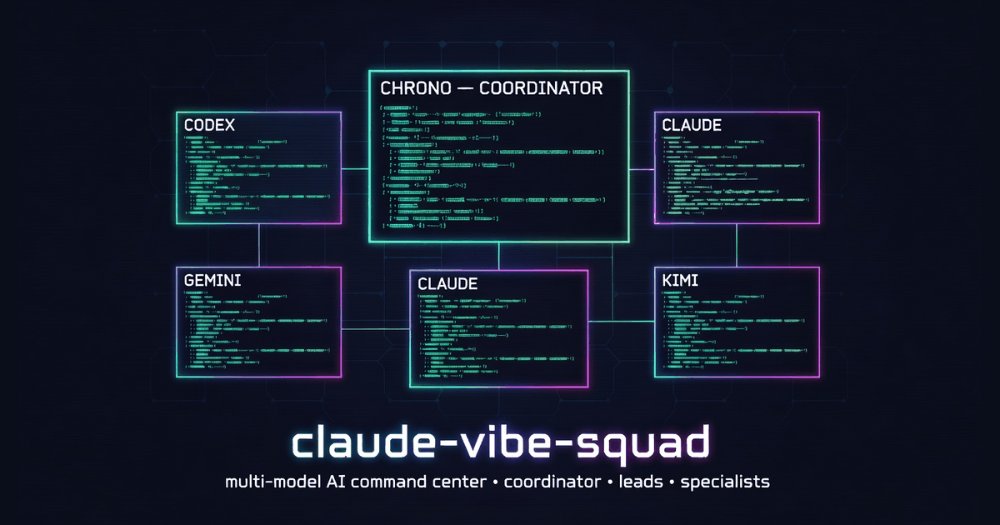
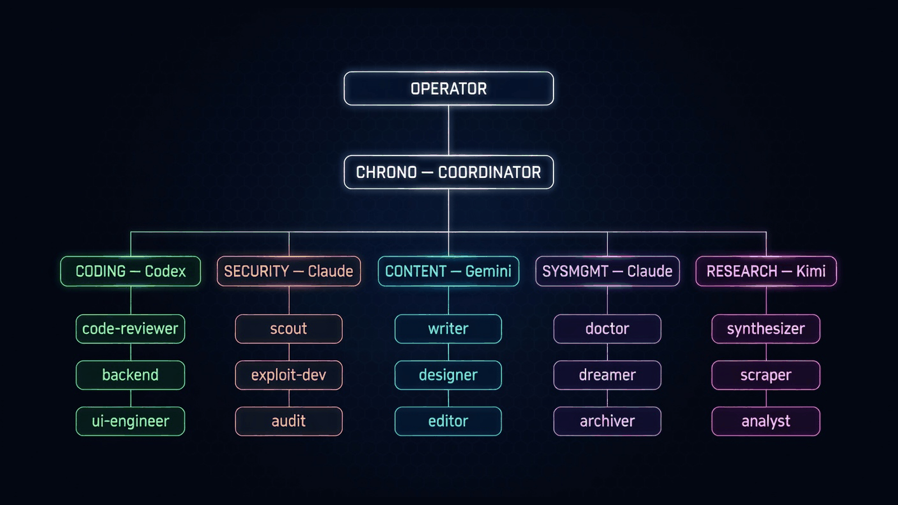
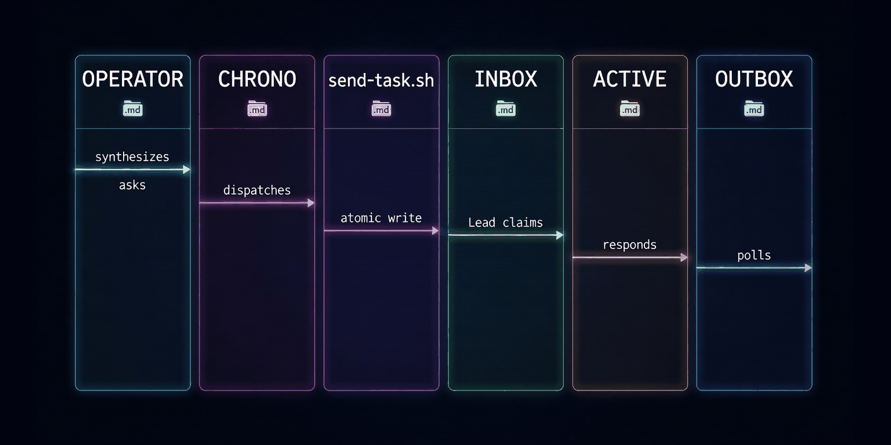
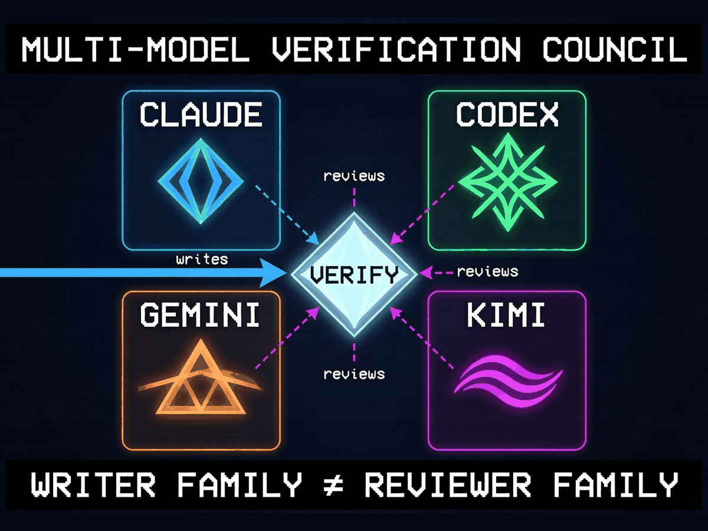

<div align="center">



# claude-vibe-squad

**A multi-model AI command center. One conversation partner ("Chrono") routes work to 5 Department Leads — each a different CLI of a different model — running persistently in their own terminal panes. Mailbox-mediated, subscription-billed, vibecoder-friendly.**

`5 Department Leads` · `4 Model Families` · `Filesystem Mailbox` · `Subscription Auth (No API Keys)` · `Multi-Model Adversarial Review` · `AGPL-3.0`

</div>

---

## ⚡ What it gives you

Each bullet leads with **what you get in plain terms**. The technical detail follows for the curious.

- **One conversation, five specialists working in the background** — You only ever talk to Chrono. When work calls for a Lead's domain, Chrono dispatches via a filesystem mailbox and your other terminal panes pick it up automatically. No pane-switching, no manual context-passing. *Implementation: `scripts/send-task.sh` writes an atomic `TASK-<id>.md` to the target Lead's `inbox/`, then `tmux send-keys -l` nudges the Lead's CLI pane. The Lead processes, writes to `outbox/`, and Chrono polls for the response.*

- **Four AI providers, all on subscription billing** — Claude Max, ChatGPT Plus, Gemini Personal OAuth, Kimi login. The launcher unsets `ANTHROPIC_API_KEY` / `OPENAI_API_KEY` / `GEMINI_API_KEY` / `GOOGLE_API_KEY` per pane so each CLI falls back to its OAuth/keychain path. Pay flat-rate, not per-token. *Implementation: `bin/launch-squad.sh` AUTH_PREFIX exports unset for every pane; `scripts/python/*.py` use `oauth_env()` helper before any subprocess call.*

- **Each Lead loads its identity from a per-cwd file** — Codex auto-loads `AGENTS.md`, Claude auto-loads `CLAUDE.md`, Gemini auto-loads `GEMINI.md`. We symlink each department's `LEAD.md` to the right name, so just opening that CLI in that directory makes it the Lead. No prompt boilerplate. *Implementation: `departments/coding/AGENTS.md → LEAD.md`, `departments/security/CLAUDE.md → LEAD.md`, etc. Kimi has no per-cwd convention, so its first message says "read `LEAD.md` and follow it."*

- **Modes never auto-engage** — Bounty / project / content / incident / research / triage / maintenance modes only start when you say so. URL pasted? Chrono *suggests* a mode and waits for your "yes." No phrase-matching that fires on accident. *Implementation: `shared/routing.md` lists concrete-signal triggers (URL patterns, file extensions, slash commands); `shared/modes/*.md` define workflows; nothing engages without explicit consent.*

- **Reviewer family ≠ writer family — adversarial review is built-in** — When a specialist runs verification, the reviewer must be a different model family. If Codex wrote, Claude or Gemini reviews. Catches single-model blind spots that go uncaught in same-family loops. *Implementation: `bin/verify.sh --writer <cli> --output <file>` dispatches to the matching reviewer chain in `scripts/python/verify.py`. Used by `bin/dream-light.sh` (Gemini journals → Codex reviews) and any mode at phase boundaries.*

- **Modes can't declare themselves done** — Vibecoding-check is a mode-exit verifier with a 4-tier severity ladder (PASS → AUTOFIX → RETRY → OPERATOR-SURFACE). Universal checks on every run: operator approval present, declared artifacts exist, citations resolve, no `TODO/FIXME/XXX` in modified code, all phase-tags emitted. *Implementation: `bin/vibecoding-check.sh` wraps `scripts/python/vibecoding_check.py`. Smoke-tested all 4 tiers.*

- **Persistent terminal sessions, never fresh starts** — All 5 Lead CLIs live in a single named tmux session. Detach with `Ctrl-b d`, reattach when you're back. Sessions survive overnight and across days — only a Mac reboot kills them. *Implementation: `bin/launch-squad.sh` creates a 6-window tmux session named `squad`; each window pre-configured with PATH + auth env + intro hint.*

- **Nightly while you sleep** — A launchd job runs doctor health checks, RSS + HTML-scrape feed sweep across podcasts and vendor blogs, kimi-summarized blog briefs, podcast headline cards, multi-model dream pass (gemini journals → codex adversarially reviews), brain cleanup KG sweep, browser CDP keep-alive across 5 bounty platforms, and synthesizes a morning brief. *Implementation: `bin/run-nightly.sh` orchestrates 8 phases via `launchd/com.claudevibesquad.nightly.plist`; `bin/run-weekly.sh` extends Sunday with deep dream + cross-source synthesis + weekly brief.*

- **Doctor surfaces what actually matters** — CLI presence, MCP registrations, secrets sourced, vault accessible, browser CDP up, disk free, tmux state, token-bleed proxy (artifact volume vs 7-day average), MCP retry-storm detection, stale `.tmp` fragments, dispatch volume + inbox backlog, long-running CLI processes. Issues bubble up to the morning brief; warnings stay in the doctor log. *Implementation: `bin/doctor.sh` 12-section report + JSON summary at `_state/doctor-logs/<date>-summary.json`.*

- **Dreaming proposes, never applies** — The dream system journals daily activity (gemini), gets adversarially reviewed (codex), and if `mode: propose` is set, extracts structured proposal cards to `_state/dream-proposals/`. The morning brief surfaces pending proposals; you approve or reject by editing each file's `status:` field. No silent KG mutation. *Implementation: `scripts/python/dream_light.py` with privacy redaction (emails, API keys, common secret patterns). `mode: shadow` (default) journals only.*

- **Subscription billing protected at every layer** — Headless calls drop API-key env vars before invoking any CLI. The auto-nudge system (mailbox → tmux send-keys) keeps Leads idle until work arrives — they don't burn quota waiting. ElevenLabs Scribe transcription is gated behind `--enable-transcription` (pay-per-minute) so no accidental spend. *Implementation: `oauth_env()` in every Python pipeline; `--enable-transcription` flag default-off.*

- **Markdown all the way down** — Mode workflows, specialist roles, Lead identities, mailbox messages, dream logs, briefs — all human-readable markdown in an Obsidian-friendly vault. Audit your AI's day by reading files, not parsing JSON. *Implementation: vault root is an Obsidian vault. Every dispatched task and every reply is a markdown file with YAML frontmatter you can grep / edit / link.*

---

## 🌳 Architecture



Three levels:

1. **You** talk only to **Chrono** (window 0 of the squad)
2. **Chrono** routes to one of **5 Department Leads** via mailbox
3. **Leads** dispatch their own **specialists** (sub-roles) and synthesize results

| Department | CLI | Model family | Owns |
|------------|-----|--------------|------|
| **Coding** | `codex` | OpenAI | implementation, refactoring, code review, deployment |
| **Security** | `claude` | Anthropic | bounty hunting, threat modeling, security audits, exploit dev |
| **Content** | `gemini` | Google | content creation, marketing assets, editorial, multimodal |
| **SysMgmt** | `claude` | Anthropic | infra, processes, hygiene, doctor, dream curation |
| **Research** | `kimi` | Moonshot | deep investigation, synthesis, learning, large-context analysis |

Each Lead has 5–14 specialists (`departments/<lead>/specialists/*.md`). Cross-cutting specialists (planner, skeptic, summarizer, vibecoding-check, prompt-engineer, triage) live in `shared/specialists/`.

---

## 📬 Mailbox flow



```
You: "let's audit this contract <URL>"
 │
 ▼
Chrono confirms intent → calls scripts/send-task.sh security /tmp/task.md
 │
 ▼
send-task.sh:
  1. atomic write → departments/security/inbox/TASK-<id>.md
  2. tmux send-keys → squad:security pane (auto-nudge)
 │
 ▼
Security Lead (Claude) picks up:
  inbox/ → active/ → process → outbox/<task-id>-response.md → archive/
 │
 ▼
Chrono polls outbox at start of every operator turn
 │
 ▼
Response synthesized → surfaced in your next reply
```

Atomic writes throughout (`temp + fsync + rename`). No partial-state corruption even on crash.

---

## 🎭 Multi-model verification



The reviewer family must differ from the writer family:

| Writer | Default reviewer chain (first available) |
|--------|------------------------------------------|
| Claude | Codex → Gemini → Kimi |
| Codex | Claude → Gemini → Kimi |
| Gemini | Claude → Codex → Kimi |
| Kimi | Claude → Codex → Gemini |

Used by:
- **dream-light** — gemini journal → codex adversarial review (catches gemini's overreach)
- **vibecoding-check** tier-3 — single-codex review of ambiguous-judgment cases
- **bin/verify.sh** — call this from any mode at phase boundaries

---

## 🚀 Quick start

```bash
# Prereqs: macOS, Homebrew, all 4 CLIs installed + logged in
brew install tmux uv jq          # core tooling
# Install + login to each CLI:
#   claude (Claude Code), codex (OpenAI), gemini (Gemini CLI), kimi (Moonshot)

# Clone the squad into your Obsidian vault directory
cd ~
git clone https://github.com/<you>/claude-vibe-squad.git Obsidian-Claude-Vibe-Squad
cd Obsidian-Claude-Vibe-Squad

# (Optional) Install nightly automation
bash bin/install-routines.sh

# Launch the squad
bash bin/launch-squad.sh

# Attach
tmux attach -t squad
```

You'll land in window 0 (chrono pane). Type `claude` and start talking. Try *"where are we"* — Chrono reads `chrono/current.md`, the morning brief, and each Lead's `current.md` to summarize state.

In each other pane, run the indicated CLI (the launcher prints the right command):
- Window 1 (coding): `codex --sandbox workspace-write`
- Window 2 (security): `claude`
- Window 3 (content): `gemini`
- Window 4 (sysmgmt): `claude`
- Window 5 (research): `kimi`, then paste *"Read LEAD.md and follow it as your role identity."*

Detach with `Ctrl-b d`. The session keeps running.

---

## 🎯 Modes

Modes are pre-defined workflows that engage on operator consent. None auto-fire on phrase matches.

| Mode | Primary Lead | When to engage |
|------|--------------|----------------|
| **bounty** | Security | bug bounty work — hunting, exploiting, validating, submitting findings |
| **project** | Coding | building or shipping a software project; spec → plan → implement → review |
| **content** | Content | writing, editing, marketing assets, brand-voice work |
| **research** | Research | deep investigation, multi-source synthesis, reading-list building |
| **incident** | SysMgmt | active error or outage that needs immediate triage |
| **maintenance** | SysMgmt | routine hygiene, KG cleanup, subscription audits |
| **triage** | (any) | unclear scope — figure out which mode applies |

Each mode is `shared/modes/<name>.md` (60–200 lines) and ships with target-type profiles in `shared/mode-profiles/<mode>/<profile>.md` (web app vs. smart contract for bounty, etc.).

---

## 🌙 Nightly automation

A launchd job runs every night while you sleep:

| Phase | What it does |
|-------|--------------|
| **doctor** | CLI presence, MCP registrations, browser CDP, disk, tmux state, token-bleed proxy, pathology detection (retry storms, runaways) |
| **browser-keep-alive** | Probes Chrome's CDP debug port, lists tabs for the 5 bounty platforms, flags expired sessions |
| **system-cleanup** | brew + npm + pip cache cleanup, /tmp prune (>7d), runs/ archival (>30d) |
| **brain-cleanup** | Vault scan for orphan notes, broken markdown links, duplicate H1s, empty stubs |
| **feed-sweep** | RSS + HTML-scrape across podcasts (3 shows) + vendor blogs (Anthropic, OpenAI, DeepMind, xAI) with cadence audit |
| **content-processing** | kimi-summarized blog briefs, headline cards for podcasts (full ElevenLabs Scribe transcription gated behind `--enable-transcription`) |
| **dream-light** | gemini journals 24h activity → codex adversarially reviews → optional `mode: propose` extracts structured proposal cards |
| **morning-brief** | Synthesizes everything: doctor status, new content, dream insights with reviewer verdict, pending proposals, active modes |

Sunday morning the **weekly deep run** adds a 7-day window dream pass, subscription audit (auth health for all 4 CLIs), mode archival (>60d), kimi cross-source synthesis ("the week in AI"), and a weekly brief.

---

## 🔐 Auth model — subscription, not API

Every paid CLI in the squad has a subscription. But each defaults to API-key billing if the corresponding env var is set in the shell. The launcher and the Python pipelines both drop the env vars before invoking any CLI.

| CLI | Subscription | Env vars dropped |
|-----|--------------|------------------|
| `claude` | Max plan (OAuth keychain) | `ANTHROPIC_API_KEY` |
| `codex` | ChatGPT login | `OPENAI_API_KEY` |
| `gemini` | personal OAuth | `GEMINI_API_KEY`, `GOOGLE_API_KEY` |
| `kimi` | `kimi login` | (none — already OAuth-only) |

You bring your own subscriptions. The squad never bills against API keys unless you explicitly enable transcription (`--enable-transcription` for ElevenLabs Scribe — pay per minute).

---

## 🧰 What's in the box

```
~/Obsidian-Claude-Vibe-Squad/
├── README.md                 ← you are here
├── CLAUDE.md                 ← vault-level system rules (auto-loaded by Claude inside vault)
├── chrono/                   ← Chrono coordinator pane
│   ├── SOUL.md               ← Chrono's identity
│   ├── CLAUDE.md             ← auto-loaded by Claude in chrono/
│   └── current.md            ← runtime state
├── departments/              ← 5 Department Leads
│   ├── coding/               (Codex — AGENTS.md → LEAD.md)
│   ├── security/             (Claude — CLAUDE.md → LEAD.md)
│   ├── content/              (Gemini — GEMINI.md → LEAD.md)
│   ├── sysmgmt/              (Claude — CLAUDE.md → LEAD.md)
│   └── research/             (Kimi — LEAD.md, loaded via first message)
├── shared/                   ← cross-cutting workflows + specialists
│   ├── protocol.md           ← mailbox message format
│   ├── routing.md            ← mode triggers + cross-Lead rules
│   ├── modes/                ← 7 mode workflows
│   ├── mode-profiles/        ← 15 target-type profiles
│   ├── specialists/          ← 6 cross-cutting (vibecoding-check, planner, skeptic, etc.)
│   └── mailbox/              ← cross-Lead message templates
├── bin/                      ← runner scripts
│   ├── launch-squad.sh       ← create the tmux session
│   ├── run-nightly.sh        ← orchestrates 8 phases
│   ├── run-weekly.sh         ← Sunday deep run
│   ├── doctor.sh             ← health checks
│   ├── feed-sweep.sh         ← RSS + html-scrape
│   ├── content-processing.sh ← summarize / transcribe new items
│   ├── dream-light.sh        ← multi-model journal pass
│   ├── morning-brief.sh      ← synthesize the brief
│   ├── vibecoding-check.sh   ← mode-exit verifier
│   ├── verify.sh             ← multi-model adversarial review
│   ├── browser-keep-alive.sh ← CDP probe for bounty sessions
│   ├── brain-cleanup.sh      ← KG light sweep
│   ├── system-cleanup.sh     ← caches + /tmp + archives
│   └── install-routines.sh   ← installs launchd plist
├── scripts/
│   ├── send-task.sh          ← Chrono's dispatch helper
│   ├── bootstrap-mcps.sh     ← register chrono MCPs across CLIs (optional)
│   └── python/               ← Python implementations (uv + PEP 723 inline deps)
├── _state/                   ← runtime artifacts (gitignored)
│   ├── feed-config.yaml      ← RSS sources + cadence rules
│   ├── dream-config.yaml     ← privacy allowlist + skip conditions
│   ├── morning-briefs/       ← daily output
│   ├── doctor-logs/          ← daily health
│   ├── dream-logs/           ← daily journal + review
│   ├── dream-proposals/      ← pending proposals (when mode=propose)
│   ├── blog-summaries/       ← kimi-synthesized briefs
│   ├── podcast-briefs/       ← headline cards
│   └── runs/                 ← mode runs (manifests + phase logs)
└── launchd/
    └── com.claudevibesquad.nightly.plist
```

---

## ⚙️ Configuration

Two YAML files in `_state/`:

- **`feed-config.yaml`** — RSS URLs, expected cadences, processors per source. Add your own podcasts / blogs here.
- **`dream-config.yaml`** — what paths the dream system can scan, exclusion patterns (secrets, finance, private journal), thresholds, mode (`shadow` / `propose` / `aggressive`).

The squad runs fine on each CLI's built-in tools. If you have your own MCP servers (e.g., a vault MCP, research MCP, content generation MCP), `bin/bootstrap-mcps.sh` registers them across Codex / Gemini / Kimi in one command. Without that registration, Leads still work — they just won't have MCP-mediated capabilities. The MCP integration is opt-in; the script gracefully exits when no MCP source is found.

---

## 🤝 Philosophy

- **Vibe-coder friendly** — minimal commands, conversational primary. You should never need to remember syntax.
- **Walk-away friendly** — modes pause at hard gates, never on time. Fall asleep mid-bounty, come back, pick up.
- **Transparent state** — every dispatch, every reply, every dream is a markdown file you can grep.
- **Composable, not magical** — the mailbox is files. The nudge is `tmux send-keys`. The verifier is a Python script. Nothing is hidden.
- **Subscription-first** — your Max / Plus / OAuth plans are the substrate. APIs are fallback only.
- **Adversarial by default** — single-model output isn't trusted for high-stakes work. Reviewer family ≠ writer family.
- **No silent KG mutation** — dreams propose; operator approves.

---

## 📜 License

[AGPL-3.0](LICENSE).

---

<div align="center">

**Built for operators who want to run AI like a control panel, not a chatbot.**

</div>
