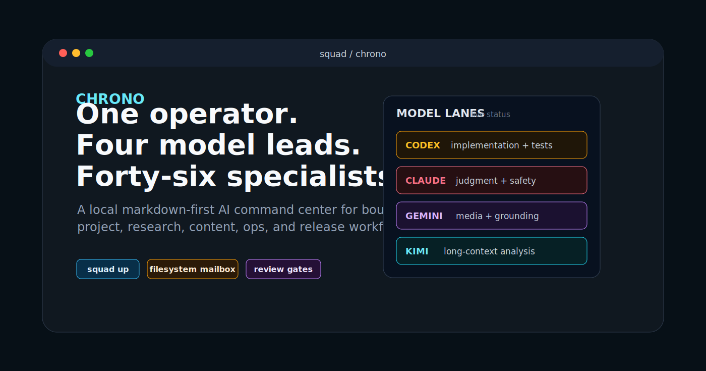
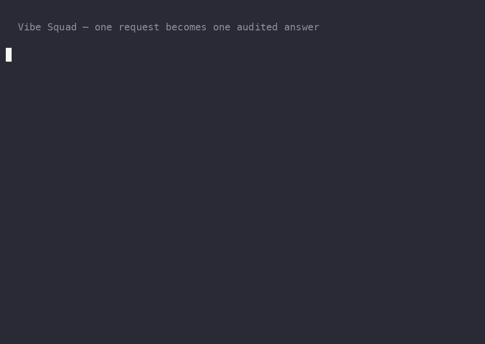
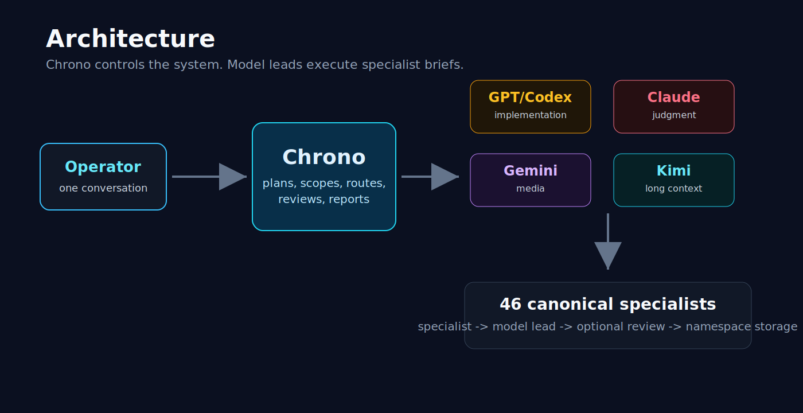
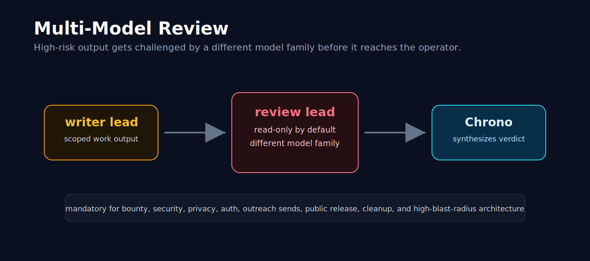
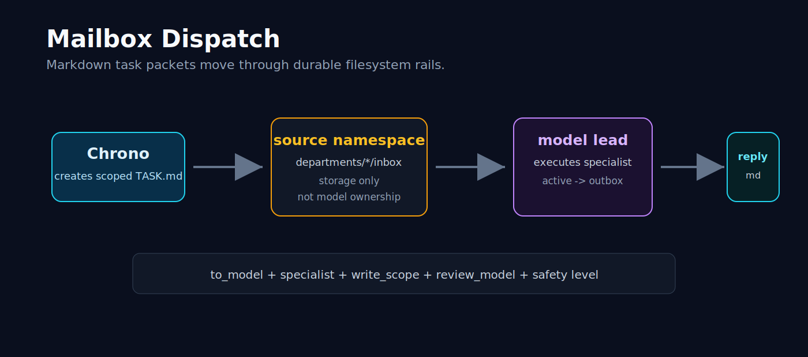

<p align="center">
  
</p>

<h1 align="center">Vibe Squad</h1>

<p align="center"><b>A swarm of frontier-model specialists that reviews its own work — and built itself.</b></p>

<p align="center">
  
  
  <a href="https://github.com/mtarcure/claude-vibe-squad/actions/workflows/squad-validate.yml"></a>
  
  
  
</p>

You talk to **one coordinator, Chrono**, in plain language. It turns your request into a scoped, inspectable task packet, routes it to whichever of **69 role-based specialists** fits best across **four live model lanes**, can fan the work out to **parallel specialist panels**, and sends the risky parts to a **different model family for review** before you ever see the result — with a **git checkpoint before every dispatch**.

> **In plain English:** it makes several different AIs behave like one coordinated team, with a built-in second opinion on anything that matters — and a paper trail for all of it.
>
> *A "panel" runs inside one lane's model family — Claude **or** Codex. The multi-model story is cross-lane coordination plus a **different-family reviewer**, not four families debating in one panel.*

<p align="center">
  <!-- PLACEHOLDER: Chrono records the real swarm run and drops the GIF here -->
  
</p>

---

## Watch it work

One request becomes one audited answer, in four beats:

1. **You ask, in plain language.** Chrono writes a typed markdown task packet and checkpoints the repo.
2. **Specialists light up in parallel.** For panel work, 2–3 canonical specialists run concurrently inside one lane — the terminal shows `⚡SWARM ×N` and each member's live state.
3. **A *different* model family reviews the risky part.** High-stakes work carries a cross-family reviewer; the dispatcher refuses to send a `safety_level: high` job without one.
4. **You get one synthesized result** — evidence-weighted, with dissent and coverage gaps preserved, written to a single `outbox/` artifact.

> ▶ **The demo above is a recorded run of the real system — landing before release.** A sanitized, reproducible end-to-end trace (parent task, member returns, panel activity state, the cross-family review, the one synthesized answer, and the commit it checkpointed to) will ship alongside it in `examples/demo-run/`.

---

## Why this is different — the moat

Most multi-agent demos optimize for more conversation. Vibe Squad optimizes for **bounded execution, independent review, visible failure, and inspectable artifacts.**

| | What it is | Proof |
|---|---|---|
| 🐝 **Real parallel panels → one accountable artifact** | 2–3 specialists run concurrently inside a lane; only the coordinator writes the result, and it preserves dissent, timeouts, and missing coverage. Panel collection is deadline-bounded (monotonic **and** wall-clock) — overdue members become explicit coverage gaps. | [`shared/modes/panel.md`](shared/modes/panel.md) · [`bin/panel-activity.sh`](bin/panel-activity.sh) |
| 🔁 **A different model family reviews the risky work** | An LLM is the worst judge of its own output. The canonical map assigns every high-safety role a reviewer from a *different* model family, and dispatch rejects high-safety work that names no reviewer. Independent, not a logo collage. | [`shared/routing.md`](shared/routing.md) · [`shared/protocol.md`](shared/protocol.md) |
| 🧾 **Git-verifiable self-building** | Every dispatch checkpoints first. The routing redesign, the panel/swarm feature, and the pre-public cleanup were all dispatched *by the squad* — the history is the receipt. | `git log --oneline --grep='auto-snapshot: before TASK-'` |
| 🎛️ **One coordinator over four live lanes** | A persistent tmux control room keeps model families observable and separately routable instead of hidden behind one opaque chat. | [`bin/launch-squad.sh`](bin/launch-squad.sh) |
| 🛡️ **Safety failures stay visible** | A genuine refusal, a gate hold, or a timeout surfaces as state; the coordinator never "shops" a refused request to a more permissive model. | [`shared/routing.md`](shared/routing.md) (safety model) |

---

## Built by vibe coding

Vibe Squad was directed in plain natural language — *"build the swarm," "add independent review," "make the state visible," "clean it up for public release."* The same system translated those goals into scoped task packets, routed them to specialist roles, ran parallel analysis where it helped, requested **cross-family review**, executed tests, and **checkpointed every dispatch in git**. It did not choose its own mission and real-world actions stayed operator-gated — you supply the goals and the approvals; the system does the dispatch, the review, and the bookkeeping.

The evidence is this repository: **100+ of its commits** are `auto-snapshot: before TASK-…` checkpoints (count them yourself — `git log --oneline --grep='auto-snapshot' | wc -l`).

> **A multi-agent system, vibe-coded through the multi-agent system itself.**

---

## How it works

<p align="center">
  
</p>

```
Operator ──one voice──▶  Chrono (coordinator)
                              │  chooses mode · specialist · model lane · write scope · reviewer
                              ▼
                   typed markdown task packet   ──▶ inbox/TASK-*.md   (+ git snapshot)
                              │  capability-fit routing over one 69-row map
        ┌─────────────────────┼─────────────────────┬─────────────────────┐
        ▼                     ▼                     ▼                     ▼
   gpt-codex               claude                gemini                 kimi
  (GPT-5.6 Sol)         (Claude Fable-5)      (Gemini 3.5)          (Kimi K2.7)
  implementation        judgment / safety     content / media      throughput-only
        │                     │                                  (0 primary roles)
        │  opt-in: 2–3 specialists run in parallel → one synthesis
        └─────────────────────┴───────┬─────────────────────────────────────┘
                                       │  high-stakes → cross-family reviewer
                                       ▼
                          outbox/TASK-*-response.md ──▶ Chrono ──▶ Operator
```

1. You ask **Chrono** for something in plain language.
2. Chrono picks the **mode**, the **specialist**, the **model lane**, the **write scope**, and — if the work is high-stakes — a **cross-family reviewer** (or a **parallel panel** of specialists).
3. It writes a **markdown task packet** to that namespace's `inbox/` — after a git snapshot and a write-scope conflict check.
4. The target **lane** reads the packet and its specialist brief, does the work, and writes a response to the `outbox/`.
5. Chrono runs any required **review**, then surfaces one result to you.

> **Routing is `specialist → model`, never `namespace → model`.** A specialist's folder is only a mailbox label. Every routing decision — primary lane, a cross-family backup, an escalation profile, and a separate reviewer — is one explicit row in [`shared/specialist-runtime-map.tsv`](shared/specialist-runtime-map.tsv), foreign-keyed into versioned profile and policy registries.

---

## Quick start

> [!IMPORTANT]
> **`squad up` defaults to an autonomous "daily-driver" profile** that launches each model-lane CLI with **bypass/yolo-style permissions** (Codex `--dangerously-bypass-approvals-and-sandbox`, Claude `--permission-mode bypassPermissions`, Gemini/Kimi `--yolo`) — the lanes run tools without per-action prompts. It's gated only by a **one-time warning marker plus a `doctor` health check** (a printed warning and a sentinel file, not an interactive confirmation). **Start with `--safe`**, which uses **conservative per-lane permissions** — Claude prompts (no bypass), Codex runs sandboxed workspace-write, and Gemini/Kimi launch non-yolo — until you understand the workflow and trust your scopes.

```bash
git clone https://github.com/mtarcure/claude-vibe-squad
cd claude-vibe-squad

bin/vibe-squad up --safe     # conservative permissions — recommended first run
# bin/vibe-squad up          # autonomous daily-driver profile (bypass/yolo perms)
```

This starts (or re-attaches) a tmux session named `squad` with six windows — the coordinator you talk to, the four model lanes, and a watchers/status window:

```
Ctrl-b 0 → chrono      Ctrl-b 3 → gemini
Ctrl-b 1 → gpt-codex   Ctrl-b 4 → kimi
Ctrl-b 2 → claude      Ctrl-b 5 → watchers/status
Ctrl-b d → detach (lanes keep running)
```

```bash
bin/vibe-squad doctor     # health check
bin/vibe-squad status     # what each lane is doing
# ...in the chrono window, just ask for something in plain language...
bin/vibe-squad stop       # tear down
```

**Prerequisites:** macOS · tmux · **fswatch · jq · curl** · logged-in Claude Code / Codex / Gemini / Kimi CLIs · **Python 3.13** (required by `pyproject.toml` and `.python-version`; needed for the MCP servers and the optional daemon).

---

## Under the hood

<details>
<summary><b>Routing &amp; the specialist map</b> — the 28-column source of truth, profiles, and policies</summary>

<br>

[`shared/specialist-runtime-map.tsv`](shared/specialist-runtime-map.tsv) is the canonical routing table: **69 rows, 28 columns**, one row per specialist. Rather than duplicating raw model IDs, each routing slot references a **profile** (`codex.sol.high`, `claude.fable.xhigh`, `gemini.flash.default`, `kimi.k2.7.bulk`, …) that resolves — in [`shared/registries/profiles.tsv`](shared/registries/profiles.tsv) — to an exact model + effort + flags. Failover, escalation, and throughput behaviour are likewise **versioned policy IDs** ([`shared/registries/policies.tsv`](shared/registries/policies.tsv)), not per-row prose.

- Each specialist declares a `capability_class` (implementation · judgment · code_review · security_reasoning · security_defense · content_text · media_production · research_synthesis · extraction · game_design), a `safety_level`, and — for media roles — a `tool_profile` that pins the lane to whichever pane hosts the required generation tools.
- The **69 roles** span seven mailbox namespaces (coding 19 · content 11 · content-engineering 10 · security 10 · sysmgmt 8 · shared 6 · research 5). Kimi is a **throughput-only lane and holds zero primary roles** — bulk/mechanical passes under a strict downshift gate only.
- [`bin/validate-specialists.sh`](bin/validate-specialists.sh) fail-closes on schema, foreign-key, sort, and rule violations — it enforces, among others, "kimi holds no primary roles" and "high/heightened-risk roles get the safety-floor escalation policy and never a throughput downshift." (The map *assigns* each high-safety role a different-family reviewer via `anti_affinity: author_family`; that family relationship is a map/authoring convention, not a validator- or dispatcher-enforced check.) The current roster passes **69/69**.
- Adding a specialist = one TSV row + a markdown brief under `departments/<namespace>/specialists/`, then run the validator.

Narrative source of truth: [`shared/routing.md`](shared/routing.md) · architecture: [`docs/architecture.md`](docs/architecture.md).

</details>

<details>
<summary><b>Inside a specialist swarm</b> — the panel-v1 contract</summary>

<br>

Panels are an **opt-in task shape**, not a new mode — without `--panel`, dispatch is unchanged.

```bash
bin/send-task.sh <task-file> \
  --panel code-reviewer,security-analyst \
  --panel-quorum all --panel-timeout 900
```

- **Supported lanes:** `claude`, `gpt-codex`. **2–3 members** (the coordinator consumes the fourth thread). Nested panels are prohibited.
- A panel's member subagents **share the parent lane's model family** — so a single panel runs *inside* Claude or Codex. The multi-model story is **cross-lane coordination and review**, not four families debating in one panel.
- All members launch **before** the coordinator waits. Polling is non-blocking and bounded by a **monotonic + wall-clock deadline**; failed, refused, late, and timed-out members stay visible as coverage gaps.
- Synthesis is **evidence-weighted, not majority vote**. The coordinator is the **only** writer and emits exactly **one** canonical artifact. Members are read-only w.r.t. the response and staging.
- [`bin/panel-activity.sh`](bin/panel-activity.sh) owns atomic per-task activity state, quorum/deadline closure, archiving, and stale cleanup; [`bin/vs-lane-status.sh`](bin/vs-lane-status.sh) renders member states and the global `⚡SWARM ×N` signal from local state (one daemon fetch per tick, zero network per render). `panel-activity` and the status renderer are covered by tests that run in CI ([`squad-validate.yml`](.github/workflows/squad-validate.yml)).

</details>

<details>
<summary><b>The safety model</b> — refusal invariant, operator gates, and pre-publication gates</summary>

<br>

<p align="center"></p>

Capability is separated from authorization — "can do" is not "may do."

- **Global safety-refusal invariant.** A genuine safety refusal on *any* lane surfaces to the operator and is **never cross-family re-dispatched in either direction.** Operational failures (an overloaded lane, a timeout) *may* fail over; refusals may not. Refusals are classified by structured policy event → typed status → content heuristic (only to *downgrade* certainty).
- **Operator gates (Hard Rule 6).** A closed set of actions require explicit approval before execution: `delete · cleanup · credential_change · public_release · paid_media · live_outreach · production_mutation · offensive_execution · malware_detonation`. The `requires_approval` field is limited to actual tool names, so domain approvals can't hide there.
- **Pre-publication gates.** `content-verifier` (fact/citation truth) and `asset-provenance-and-rights-auditor` (license/consent/rights) each emit a hash-bound PASS/HOLD/FAIL record; a non-PASS or a stale content hash blocks publication.
- **Cross-family mandatory review is a dispatch-time contract, not automation.** The canonical map gives every high-safety specialist a different-family reviewer, and dispatch rejects high-safety work that names no reviewer — but the *family difference itself is a map assignment, not a dispatcher comparison.* Same-family reviews run in-lane before "done," and cross-family reviews are **Chrono-coordinated after the response lands** — there is no watcher that auto-launches every review (see [`shared/protocol.md`](shared/protocol.md)).

</details>

<details>
<summary><b>Dispatch protocol &amp; repo tour</b> — packet schema, lifecycle, and where things live</summary>

<br>

<p align="center"></p>

Every dispatch is a markdown file with the frontmatter schema in [`shared/protocol.md`](shared/protocol.md) (`to_model`, `specialist`, `source_namespace`, `write_scope`, `review_model`, `mandatory_review`, `operator_approved`, `return_artifact`, …). `source_namespace` selects the specialist markdown; `compatibility_namespace` selects the mailbox folder; `to_model` selects the runtime lane. Dispatch is asynchronous — senders don't block on lane-to-lane work, and one writer owns a `write_scope` at a time.

| Path | Purpose |
|------|---------|
| `bin/squad`, `bin/launch-squad.sh` | Lifecycle CLI + tmux launcher (six windows) |
| `scripts/send-task.sh`, `bin/send-task.sh` | Dispatch: frontmatter generation + hardened writer (snapshot, write-scope check, nudge) |
| `shared/specialist-runtime-map.tsv` | Canonical routing (69 rows) + `shared/registries/*.tsv` (profiles, policies) |
| `shared/routing.md`, `shared/protocol.md` | Routing model + packet schema / lifecycle / review behaviour |
| `shared/modes/*.md` | Operator-approved workflows (project, bounty, incident, content, research, triage, …) |
| `departments/*/specialists/`, `shared/specialists/` | Specialist markdown briefs |
| `departments/*/inbox/`, `departments/*/outbox/` | The dispatch board (packets + responses) — private/local, git-ignored |
| `bin/validate-specialists.sh` | Fail-closed schema/routing validator |
| `daemon/` | Optional FastAPI service (status, summaries, triggers) — **not** on the dispatch path |

</details>

<details>
<summary><b>Tools, plugins &amp; the optional daemon</b></summary>

<br>

- **The primary tool path is direct per-CLI MCP registration** (`~/.claude/settings.json`, `~/.codex/config.toml`, `~/.kimi/mcp.json`, `~/.gemini/settings.json`); the optional daemon also exposes a `/mcp/{server}/{tool}` proxy route. Four vendored plugins ship with the repo: **chrono-vault** (knowledge graph + Obsidian + auto-capture), **chrono-research-arsenal** (an arXiv/xAI wrapper plus the official Perplexity sibling MCP), **chrono-content-engineer** (image/video/audio), and **chrono-recon** (DNS / WHOIS / certificate-transparency / Wayback / GitHub-secret helpers). Availability varies by credential and lane; [`shared/api-catalog.md`](shared/api-catalog.md) tracks a `verified:` state per capability, and a specialist may only cite verified entries.
- A **library of reusable skill modules** lives under [`shared/skills/`](shared/skills/) (indexed in `shared/skills/catalog.txt`); specialist briefs reference them and the validator checks they exist.
- The optional **FastAPI daemon** ([`daemon/`](daemon/)) exposes authenticated status/summary/trigger endpoints with circuit breakers and a watcher, covered by tests in [`daemon/tests/`](daemon/tests/). It supports the system; it is **not** the dispatch spine.

</details>

---

## What's shipped vs. what isn't

- **Shipped:** the tmux + markdown-mailbox runtime; the 69-specialist canonical map with profile/policy registries and a fail-closed validator (69/69); opt-in parallel specialist panels with a live status UI; per-CLI MCP tooling; auto-snapshot + write-scope dispatch rails; the safety/approval model.
- **Automatic failover:** built and cross-family-reviewed, but ships **dormant/opt-in** — not part of the default workflow.
- **Historical design:** an earlier Ink-TUI + FastAPI-daemon dispatch-spine proposal was not implemented and is retained only as a curated narrative under [`docs/design/`](docs/design/). The shipped spine is the markdown mailbox.

## License

AGPL-3.0. See [LICENSE](./LICENSE).

---

<p align="center"><sub>This README, and the roster redesign and cleanup it describes, were produced through the squad's own multi-model workflow — dispatched, cross-reviewed, and checkpointed in this repo's own git history.</sub></p>
