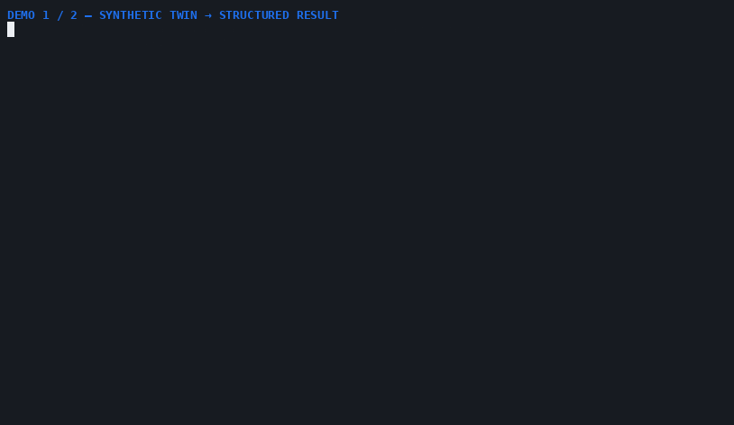

<div align="center">

# Vibe Squad

**One coordinator plans the work, dispatches each piece to the best frontier model for the job — and a *different* model family must independently review anything security- or judgment-critical before it lands.**


<br>


*That capture is a real dispatch: task in, best-fit model chosen, isolated run, cross-family review, atomic settle.*

</div>

---

## Quickstart

You need macOS, tmux, `fswatch`, `jq`, `curl`, Python 3.13, and logged-in Claude Code, Codex, Gemini, and Kimi CLIs.

```bash
git clone https://github.com/mtarcure/claude-vibe-squad.git
cd claude-vibe-squad
bin/squad doctor
bin/squad up --safe
```

`bin/squad up` opens a persistent tmux control room — a Chrono window plus a watchers/status window (`Ctrl-b d` detaches; the watchers keep running). There are no per-model panes: each task spawns a fresh model CLI on the board. Ask Chrono for work in plain language and drive the lifecycle with `bin/squad status | doctor | stop`.

> **Start with `--safe`.** The autonomous daily-driver profile launches the provider CLIs with broader bypass/yolo-style permissions after a warning and health check — review scopes, credentials, and the workflow first.

## Why Vibe Squad?

Vibe Squad is a markdown-first **multi-model agent orchestration** platform. **OpenAI Codex, Anthropic Claude, Google Gemini, and Moonshot Kimi** are all first-class: each **specialist** is a markdown brief bound to whichever model evaluates best for its job, running as a fresh, capability-scoped CLI in its **own git worktree**, reaching tools through the **Model Context Protocol (MCP)**. The hard part isn't making models *act* — it's **secure agent execution**. Four properties carry that:

- **Cross-family review, machine-enforced.** A task authored by one model family *cannot self-settle* — the board requires an approving reviewer from a **different** family on security- and judgment-critical work. Independence is a property of the dispatch machinery, not a convention a reviewer can waive.
- **Board-native isolation + atomic publish.** Every attempt runs in its own worktree; results publish **artifact-first, envelope-last** and are validated *outside* the worktree, so a half-finished or tampered attempt never becomes state.
- **Capability → protocol derivation.** A task's `capability:` selects the *validated workflow* (which phases run, which gates fire) — never the model, which is a separate quality-first routing decision — and the derived contract is dispatcher-pinned: required phases, review policy, and result path carry a **SHA-256** digest that every layer re-validates. A worker cannot quietly widen its own scope or skip a phase; "what safety this work demands" stays independent from "who happens to run it."
- **Markdown-first.** The instruction layer is the product: modes, capability cards, specialist briefs, and routing rules are markdown a human can read, review, and diff — you review prose, not call graphs, and a brief is portable across providers. The code is a thin, auditable rail that dispatches, isolates, pins contracts, enforces review, and settles atomically, but does not encode judgment.

*Evidence on multi-agent debate is mixed; this design relies on independent verifier separation — not a claim that debate makes models smarter — and no published study tests this exact cross-family gate.*

## How it works


```mermaid
flowchart LR
    OP([Operator]):::human -->|consent + goal| CO[Coordinator]
    CO -->|capability → protocol| RAIL[Board rail<br/>dispatch + verification contract]
    RAIL -->|fresh scoped CLI| WT[Git worktree<br/>per attempt]
    WT --> SPEC[Specialist model<br/>Codex · Claude · Gemini · Kimi]
    SPEC -->|artifact first| PUB[Out-of-worktree<br/>validation]
    PUB -->|different family| REV{Cross-family<br/>review}
    REV -->|approve| SETTLE[(Atomic settle<br/>envelope last)]
    REV -->|reject / needs human| OP
    SETTLE --> OP
    classDef human fill:#2d3748,stroke:#90cdf4,color:#fff;
```

The **coordinator** is the only operator-facing voice — specialists never talk to the operator directly. The worker recalls prior context from memory (untrusted notes arrive quoted), does the work, and writes its artifact first; **cross-family review** is the gate between "done" and "landed"; **atomic settle** writes the envelope last, so a task is either fully landed or not landed at all. Rejects and `needs_human` route back to the operator, and outcomes are recorded to memory for the next session.

## Under the hood

Every mechanism below is real and shipped; citations link straight to the grounding literature.

<details>
<summary><b>Worktree isolation & atomic publish</b> — clean per-task contexts; temp → fsync → rename, never in place</summary>
<br>

Each attempt is a dedicated git worktree running a freshly spawned, capability-scoped CLI; shared state is written temp file → fsync → atomic rename. Isolation is a *reliability* choice too: models measurably lose track of information buried in long contexts ([Liu et al. 2023](https://arxiv.org/abs/2307.03172)), and isolated per-task contexts outperform one monolithic coordinator session ([Chain of Agents 2024](https://arxiv.org/abs/2406.02818)). Because the worker is a separate process that can be a *different model family* — not an in-session subagent inheriting the coordinator's context and bias — the review gate is a genuine second opinion.
</details>

<details>
<summary><b>Cross-family review</b> — the flagship guardrail: no model judges its own work</summary>
<br>

LLMs are unreliable self-critics ([Huang et al. 2023](https://arxiv.org/abs/2310.01798); [Kamoi et al. 2024](https://arxiv.org/abs/2406.01297)): a model reliably fixes an error an external source flags, yet misses the *same* error in its own output ([Self-Correction Bench 2025](https://arxiv.org/abs/2507.02778)). Heterogeneous models fail differently ([Dietterich 2000](https://link.springer.com/chapter/10.1007/3-540-45014-9_1); [LLM Ensemble survey 2025](https://arxiv.org/abs/2502.18036)), and a *separate* verifier lifts even a stronger generator ([Multi-Agent Verification 2025](https://arxiv.org/abs/2502.20379); [LLM-as-a-Judge survey 2024](https://arxiv.org/abs/2411.15594); [Du et al. 2023](https://arxiv.org/abs/2305.14325)). So the board enforces **anti-affinity**: a Claude-authored security task literally cannot be settled by a Claude reviewer.

*Honesty note:* these results motivate the design — no published study evaluates "reviewer family ≠ author family" gating exactly as built here, and the gains are benchmark-scoped. An evidence-motivated engineering choice, not a proven theorem.
</details>

<details>
<summary><b>Dispatcher-pinned verification contracts</b> — the worker can't renegotiate its own rails</summary>
<br>

At dispatch the coordinator computes the required phases, review policy, memory policy, and expected result path, pins them with a **SHA-256** digest, and every layer that touches the task re-validates that digest. The contract is fixed by the dispatcher, not negotiated by the model doing the work.
</details>

<details>
<summary><b>Fail-closed private memory</b> — RAG notes as data, never instructions</summary>
<br>

Durable knowledge is retrieval-augmented markdown, so decisions cite specific, provenance-bearing evidence instead of parametric recall alone ([Lewis et al. 2020](https://arxiv.org/abs/2005.11401); [A-MEM 2025](https://arxiv.org/abs/2502.12110)). The vault resolves its storage root defensively and *refuses to write into any public tree*. Recalled note bodies return wrapped as explicitly quoted, **untrusted** content, because retrieved content is a real hijack vector for tool-using agents ([Greshake et al. 2023](https://arxiv.org/abs/2302.12173); [AgentDojo 2024](https://arxiv.org/abs/2406.13352)); the stance is contain, don't filter ([CaMeL 2025](https://arxiv.org/abs/2503.18813); [OWASP LLM Top-10 2025](https://owasp.org/www-project-top-10-for-large-language-model-applications/assets/PDF/OWASP-Top-10-for-LLMs-v2025.pdf), an industry framework, not peer-reviewed research).
</details>

<details>
<summary><b>Guarded MCP supply chain</b> — schema-pinned tools, attested provenance</summary>
<br>

Security tooling is never wired to models raw — it is proxied through a schema-pinning guard (Trail of Bits' `mcp-context-protector`), so a compromised or drifted MCP server cannot silently change the shape of the tools an agent trusts. The framing is attested supply-chain provenance ([in-toto, Torres-Arias et al. 2019](https://www.usenix.org/conference/usenixsecurity19/presentation/torres-arias); [SLSA](https://slsa.dev/spec/v1.0/about), an industry framework).
</details>

<details>
<summary><b>Quality-first, deny-default routing</b> — the best model per task, never the cheapest by default</summary>
<br>

Every specialist binds to the model that evaluates best for its task type — long-context analysis, code synthesis, cited research, adversarial breadth — across all four providers, informed by published benchmarks plus the squad's own eval passes, operator-confirmed, and re-bound as the frontier moves (~150 bindings refreshed in the latest roster pass). The cheapest lane is **deny-by-default**, running only under explicit operator-ratified exceptions, so a cost incentive can't quietly degrade judgment-critical work ([Saltzer & Schroeder 1975](https://web.mit.edu/Saltzer/www/publications/protection/)).
</details>

<details>
<summary><b>Swarms, without losing scrutiny</b> — fan out to many models; every path still ends at review</summary>
<br>

A dispatch can widen: the same task to multiple families with a deterministic **agreement/divergence** diff; bounded 2–3-member panels under quorum with one accountable coordinator (honest scope: `panel-v1` accepts Claude and Codex, and a panel collects perspectives — it is not the review); or a lead fanning native subagents where *every* decomposed subject gets its own cross-family verdict (honest status: proven end-to-end on gpt-codex; Claude and Gemini supported but not yet exercised; Kimi's subagents cannot hold MCP). More agents, never less scrutiny.
</details>

## The specialist roster

Behavior is carried by **73 canonical specialists** — each a markdown brief declaring a **capability class**, a **bound model**, and a **safety level** — projected into **163 generated adapters**, each stamped with a `capability_source_sha256` tying it back to its canonical source. A specialist's `capability_state` is machine-derived and validated (`bin/validate-capabilities.sh`), not hand-set, so the roster stays honest by construction.

| Department | Count | Example specialists | What they own |
|---|---:|---|---|
| **Coding** | 20 | `backend-engineer`, `frontend-engineer`, `devops-engineer`, `test-engineer` | Services, data, UI, web, CI/infra, tests |
| **Security** | 11 | `security-analyst`, `threat-modeler`, `exploit-developer`, `impact-validator` | Vulnerability reasoning, attack modeling, PoC + impact adjudication |
| **Content & Media** | 20 | `editor`, `brand-voice`, `image-designer`, `video-director`, `content-verifier` | Docs & prose; governed generative media; truth & rights publication gates |
| **Sysmgmt** | 8 | `harness-optimizer`, `memory-curator`, `mac-ops`, `agentops` | Environment/agent hygiene, memory curation, runtime ops |
| **Shared / advisors** | 8 | `planner`, `skeptic`, `triage`, `sol`, `fable` | Cross-cutting planning, independent challenge, blank second opinions |
| **Research** | 6 | `research`, `synthesizer`, `large-context-analyst` | Source-first investigation and cited synthesis |

## Two work modes

The same core — capability-derived protocol, worktree isolation, pinned contract, cross-family review, atomic settle — drives both.

**[Project](shared/modes/project.md)** is the single typed build lifecycle, **S0–S7**: scope → requirements + recall → design → build → verify → cross-family review → deliver → record + atomic settle. Content, research, operations, and incident work fold in as *capabilities* under this one lifecycle, with per-capability gates (truth/rights on publish; delete/credential/production gates on operations) that never weaken when a capability folds in.

**[Bounty](shared/modes/bounty.md)** runs one target-agnostic offensive skill (`systematic-attacking`) under two co-equal iron laws:

```
IRON LAW 1 (safety): NO OFFENSIVE ACTION OUTSIDE AUTHORIZED, VERIFIED SCOPE.
IRON LAW 2 (rigor):  NO FINDING WITHOUT A REPRODUCED, NEGATIVE-CONTROLLED,
                     INTRINSIC-IMPACT PROOF.
```

Its discipline is **find → chain → prove → dedup → package**: only a **finding** — reproduced, negative-controlled, clearing an intrinsic-impact bar, and independently reproduced by a *different model family* — may be submitted. A mandatory multi-model fan-out precedes any real-money submission, and the final Submit click is always a **human operator gate**.

## The safety model, stated honestly

The board runs workers under a real macOS Seatbelt sandbox that the kernel enforces, and this table states every control at the enforcement class it actually holds — none described as stronger than it is, none undersold.

| Boundary | Mechanism | Enforcement class |
|---|---|---|
| Model-CLI exec denied to workers | macOS Seatbelt profile (`sandbox-exec`) | **OS-enforced** — the kernel denies the `exec` (strict launch mode). Operator-selectable per deployment; the default final-worker path runs host-unpinned for throughput, backed by worktree isolation + attested scope |
| Worker → broker-only network egress | Same Seatbelt profile | **OS-enforced** — non-broker sockets denied at the syscall boundary (strict launch mode) |
| Per-attempt filesystem isolation | A dedicated git worktree per attempt | **Structurally enforced** (separate tree; atomic publish) |
| Write scope / action scope | Dispatcher-pinned, SHA-256-stamped attestation re-validated at each layer | **Attested + validated** (not OS-enforced) |
| Independent review before landing | Cross-family anti-affinity in the board | **Machine-enforced** (a task cannot self-settle) |
| Credential access | Workers hold the credentials their tasks require | **Documented trust boundary** (a deliberate design choice — *not* OS-isolated secrets) |
| Irreversible / external actions | Operator gate: deletes, credential changes, public release, live sends, production mutation, spend | **Human approval required** (human-in-the-loop) |

Read top to bottom, the enforcement class moves *by design* from OS-enforced to machine-enforced to attested to human-gated. Two things are deliberately not overstated: a worker holds the credentials its task needs — a stated design decision, not dressed up as OS-enforced secret isolation — and write scope is an attestation re-validated at every layer, which is strong for integrity and drift-detection while being honest that it is validation, not a kernel denying the write. That legibility is the point.

## Worked example — a differential impact-verification lab



[`moat/`](moat/README.md) is one concrete thing the platform builds and ships: a **differential impact-verification lab — not an exploit launcher.** It turns a human-reviewed invariant into a reproducible JavaScript/TypeScript *vulnerable-vs-patched* experiment and emits an evidence-referenced `PASS`, `FAIL`, or `INCONCLUSIVE` from a hardened Docker runner (no network, read-only root, non-root user, resource limits) that **fails closed**: a mandatory preflight must prove the loopback control reachable while all external network paths are blocked, or the experiment aborts. Real targets and payloads stay private; the public repo ships only the generic engine and a synthetic reference workload (no smart-contract adapters, no signed results, no universal fail-closed guarantee beyond what is shown).

## Repo tour

<details>
<summary>Layout, orientation reading, and validation commands</summary>

```
<repo>/
├── shared/            # source of truth: modes, capabilities, specialists, routing.md, protocol.md, skills
├── departments/       # per-domain specialist briefs + mailboxes (coding, security, content, research, sysmgmt)
├── model-lanes/       # generated per-lane adapters (163) with capability provenance
├── bin/               # the execution rail: dispatch, board supervisor, reconcile, validate
├── plugins/           # MCP servers: memory vault, guarded security stack, media, recon
├── moat/              # differential impact-verification lab (above)
├── docs/              # design records, architecture, and audits
└── LICENSE            # AGPL-3.0
```

To orient: read `CLAUDE.md`, `shared/protocol.md`, and `shared/routing.md` (the contract you operate under), the two modes under `shared/modes/`, and the roster in `shared/specialist-runtime-map.tsv`; then run `bin/validate-capabilities.sh && bin/test`. Configuration is path-generic — the repo root resolves through a shared resolver and private state lives under `$VAULT_ROOT`, so no absolute home paths are baked in.
</details>

> **Status, honestly.** An actively developed daily driver, not a turnkey release. Its boundaries are stated at the enforcement class they actually hold (see the safety model above).

## Contributing & license

Start with [`CONTRIBUTING.md`](CONTRIBUTING.md); architecture and operating guides live under [`docs/`](docs/), and [`docs/adding-a-specialist.md`](docs/adding-a-specialist.md) explains how to extend the role catalog. This repository is the complete runnable public distribution — forkers can clone and operate it normally; keep generated state, mailbox traffic, credentials, target data, and memory private. Licensed **AGPL-3.0** — see [`LICENSE`](LICENSE).

---

<sub>Vibe Squad · markdown-first multi-model agent orchestration · AGPL-3.0. Model families: OpenAI Codex · Anthropic Claude · Google Gemini · Moonshot Kimi. Boundaries stated at the enforcement class they actually hold.</sub>
