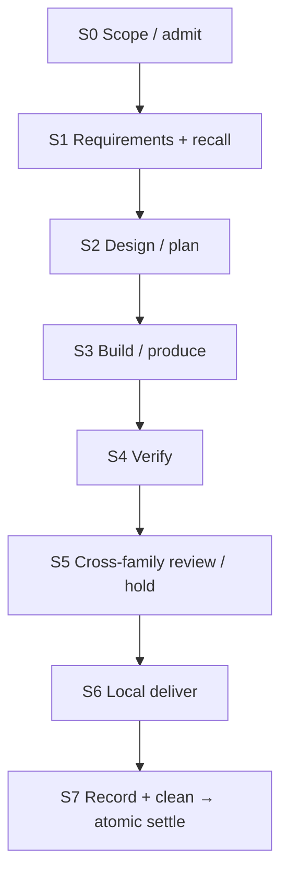
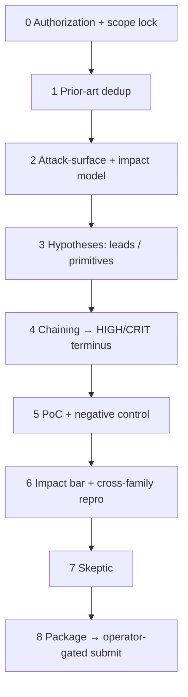

<div align="center">

# Vibe Squad

**A markdown-first orchestration platform where one coordinator plans work, dispatches it to the best AI model for the job, and a *different* model family must independently review anything security- or judgment-critical before it can land.**


<br>


</div>

---

## 1 · What it is

Vibe Squad is an **agentic orchestration** platform for real **generative AI** work. A single coordinator decomposes a goal and dispatches each piece — this is **LLM orchestration** — to a **specialist**: a markdown brief bound to whichever frontier model is best at that job, running as a fresh, worktree-isolated CLI. It is **model-agnostic / multi-provider** by construction — **OpenAI Codex, Anthropic Claude, Google Gemini, and Moonshot Kimi** are all first-class lanes, chosen per task. Specialists reach **tools** through the **Model Context Protocol (MCP)**; durable knowledge lives in a fail-closed **RAG / agentic memory** that quotes untrusted notes instead of trusting them; and **AI guardrails** treat every **multi-agent system** output as unverified until an independent model checks it. The hard part isn't making models *act* — it's **secure agent execution**: safe, isolated, self-checking, with a **human-in-the-loop** at every irreversible edge.

The instruction layer is the product: behavior lives in markdown, and the code is a thin, auditable execution rail beneath it.

## 2 · Why it's different

- **Machine-enforced cross-family review.** A task authored by one model family *cannot self-settle*. The board requires a reviewer from a **different** model family to approve security- and judgment-critical work before it lands — the independence is a property of the dispatch machinery, not a convention a reviewer can waive.
- **Board-native isolation.** Every attempt runs in its **own git worktree** with a fresh, capability-scoped CLI. Results are published **artifact-first, envelope-last** and validated *outside* the worktree, so a half-finished or tampered attempt never becomes state.
- **Capability → protocol derivation.** A task's `capability:` selects the *validated workflow* (which phases run, which gates fire) — and never the model. Model selection is a separate, quality-first routing decision. This keeps "what safety this work demands" independent from "who happens to run it."
- **Markdown-first.** The product is a library of instruction files a human can read and diff. The runtime exists to execute them faithfully and atomically, not to hide behavior inside code.

## 3 · Architecture at a glance


```mermaid
flowchart LR
    OP([Operator]):::human -->|consent + goal| CO[Coordinator]
    CO -->|capability → protocol| RAIL[Board rail<br/>dispatch + verification contract]
    RAIL -->|fresh scoped CLI| WT[Git worktree<br/>per attempt]
    WT --> SPEC[Specialist model<br/>Codex · Claude · Gemini · Kimi]
    SPEC -->|artifact first| PUB[Out-of-worktree<br/>validation]
    PUB -->|different family| REV{Cross-family<br/>review}
    REV -->|approve| SETTLE[(Atomic settle<br/>envelope last)]
    REV -->|reject / needs human| OP
    SETTLE --> OP
    classDef human fill:#2d3748,stroke:#90cdf4,color:#fff;
```

**Callouts.** The **coordinator** is the only operator-facing voice; specialists never talk to the operator directly. The **board rail** pins a verification contract to each dispatch and re-checks it at every layer. The **worktree** is the unit of isolation. **Cross-family review** is the gate between "done" and "landed." **Atomic settle** publishes the envelope last, so a task is either fully landed or not landed at all.

## 4 · The mechanisms

The depth is in *how* each of the above is actually built. Each subsection describes a real mechanism; research citations are bracketed and resolve to the bibliography in §12.

### 4.1 Board-native isolation & atomic publish

Each dispatch attempt is materialized as a **dedicated git worktree** and runs a **freshly spawned, capability-scoped CLI**. The worker writes its deliverable (the *return artifact*) first; only after the artifact is validated *from outside the worktree* does the system write the small completion **envelope** that flips the task to landed. This **artifact-first / envelope-last** ordering means a crash, a timeout, or a tampered run leaves no half-committed state — an attempt is atomic. Shared state is written with the classic durable pattern (temp file → fsync → atomic rename), never in place.

Isolation here is a *reliability* choice, not only a safety one. Each specialist gets a **clean, bounded context** instead of accumulating into one ever-growing coordinator session — which matters because models measurably lose track of information buried in long contexts [Liu et al. 2023], and isolated per-task contexts outperform monolithic long-context coordination [Chain of Agents 2024]. And because the worker is a **separate process that can be a *different model family*** — not an in-session subagent that would inherit the coordinator's own context and bias — this isolation is exactly what makes the cross-family review in §4.3 a genuine second opinion rather than a same-session self-check.

### 4.2 Dispatcher-pinned verification contract

At dispatch time the coordinator computes a **verification contract** — the set of phases that must run, the review policy, the memory policy, the expected result path — and pins it with a **SHA-256** digest. That digest is carried into the worker's runtime envelope and is **echoed back and re-validated** at each layer that touches the task. The worker cannot quietly widen its own scope or skip a required phase: the contract it must satisfy is fixed by the dispatcher and cryptographically identified, not negotiated by the model doing the work.

### 4.3 Cross-family review (the flagship guardrail)

The single most load-bearing idea in the system: **a model should not be the sole judge of its own work.** This is grounded in a clear research result — LLMs are unreliable *self*-critics. Models frequently fail to correct their own reasoning without external feedback, and can even degrade after trying [Huang et al. 2023]; self-correction works reliably *only when the feedback comes from outside the model* [Kamoi et al. 2024]. Recent work quantifies the gap as a **self-correction blind spot** — models reliably fix an error when an external source flags it, yet miss the *same* error in their own output [Self-Correction Bench, 2025]. So Vibe Squad never lets a model bless its own output on anything that matters.

The engineering that provides that outside signal is **anti-affinity**: the reviewer is drawn from a *different model family* than the author, and the board enforces it — a Claude-authored security task literally cannot be settled by a Claude reviewer. The motivation is the ensemble-diversity literature: different models fail differently, so cross-checking heterogeneous models catches errors a single model misses [Dietterich 2000; LLM Ensemble survey, 2025]. The sharpest modern form of the claim is **verifier separation** — a *separate* model checking the author's work scales as its own axis of test-time compute, and even weak independent verifiers lift a stronger generator [Multi-Agent Verification, 2025] — which is exactly what a dedicated *LLM-as-a-judge* does when the judge is a different model from the one under review [LLM-as-a-Judge survey, 2024]. The original "society of minds" debate result motivates the idea [Du et al. 2023]; the 2025–2026 literature is mixed on whether extra debate *rounds* help on frontier models, but consistent that a **separate, heterogeneous checker** catches what the author misses — which is the claim this board actually implements.

> **Honesty note.** The diversity and verifier-separation results *motivate* anti-affinity; no published study evaluates "reviewer family ≠ author family" review-gating exactly as this system implements it. The gains above are **benchmark-scoped**, not a universal guarantee — and the 2025–2026 record on multi-agent *debate specifically* is mixed, which is precisely why the claim we lean on is verifier **separation** (a different model checking the work), not "debate makes models smarter." We treat cross-family review as a principled, evidence-motivated engineering choice — not as a proven theorem.

### 4.4 Fail-closed private memory = agentic memory / RAG

Durable cross-session knowledge is a **retrieval-augmented memory**: notes are stored as markdown and pulled back by ranked search, so a specialist's decisions can cite specific, provenance-bearing evidence instead of leaning on parametric recall alone — the RAG argument for more specific, factual, attributable generation [Lewis et al. 2020]. Recent work carries this from document RAG into **agentic memory** proper: dynamically linked, self-evolving notes as an agent's long-term store [A-MEM, 2025].

Two properties make it safe rather than merely useful:

- **Worktree-aware, fail-closed vault root.** The memory server resolves its storage root defensively and *refuses to write into any public tree*. If it cannot establish a safe private root, it fails closed rather than leaking notes into a shippable directory.
- **Untrusted-note quoting as prompt-injection defense.** Recalled note bodies are returned **wrapped as explicitly quoted, untrusted content** (`[BEGIN QUOTED UNTRUSTED NOTE] … [END …]`). A stored note is *data*, never instructions — because ingested/retrieved content is a real hijack vector for tool-using agents: the data–instruction boundary is exactly where indirect prompt injection lives [Greshake et al. 2023], and tool-returned data hijacking agents is measurable with defenses still incomplete, so the design **contains** rather than merely filters [AgentDojo, Debenedetti et al. 2024]. That "contain, don't filter" stance is now a published defense pattern — separate control flow from untrusted data so injected text *cannot* redirect the program [CaMeL, 2025] — and prompt injection remains the #1 risk in the industry's consensus ranking [OWASP LLM Top-10, 2025 — an industry framework, not peer-reviewed research]. Access is further scoped by per-lane clearance owned by the server, not by the caller.

### 4.5 Guarded MCP supply chain

Security tooling (static analysis, precedent search, and similar) is not wired to the models raw. It is **proxied through a schema-pinning guard** (Trail of Bits' `mcp-context-protector`) that pins each tool's schema and mediates what the model can invoke, so a compromised or drifted **MCP** server cannot silently change the shape of the tools an agent trusts. The framing is supply-chain provenance: cryptographically attesting each step of a pipeline end-to-end defeats real-world supply-chain compromises [in-toto, Torres-Arias et al. 2019], and leveled artifact-integrity practice is codified industry guidance [SLSA — an industry framework, not peer-reviewed research].

### 4.6 Quality-first, deny-default model routing

Routing is **quality-first**: every specialist is bound to the model that **evaluates best for its specific task type** — long-context analysis, code synthesis, cited research, adversarial breadth — across all four providers, never to a single house model. Those bindings are a deliberate per-capability engineering decision, informed by **published model benchmarks and the squad's own model-eval passes**, operator-confirmed, and **re-bound as the frontier moves** (the roster was recently refreshed across an Opus 5 / K3 / Sol-Ultra update, touching ~150 specialist bindings in one pass). The cheapest lane is **deny-by-default** — it runs only where an explicit, operator-ratified exception says it may — which keeps a cost incentive from quietly degrading judgment-critical work. This is the concrete meaning of **model-agnostic / multi-provider** here: provider choice is an evidence-driven decision per capability, so no single vendor is a systemic single point of failure, and the roster tracks the best available model instead of freezing on one.

### 4.7 One CLI per specialist — and, when it helps, a swarm

Because every specialist is its own fresh process rather than an in-session subagent, a dispatch can be *widened* without collapsing the independence the whole system is built on:

- **Cross-family swarm** — the *same* task is delivered to multiple model families in parallel; each returns its own packet, verification contract, and artifact, and a controller emits a deterministic **agreement / divergence** diff. Consensus across genuinely different families is a far stronger signal than any single model's confidence.
- **Bounded panels** — 2–3 specialist perspectives run concurrently under quorum, deadlines, visible member states, and one accountable coordinator who owns the final artifact. Honest scope: `panel-v1` accepts Claude and Codex, and a panel *collects* perspectives — it is not a substitute for the independent cross-family review.
- **Lead-internal sub-swarm** — one lead fans structured native subagents for a large pass, then **every** decomposed subject gets its own cross-family verdict, with no sampling. Honest status: proven runnable **on gpt-codex today**; Claude and Gemini are supported but not yet exercised end-to-end, and Kimi has none, because its subagents cannot hold MCP.

Every widening still ends where a single dispatch does: a **different model family** must review anything security- or judgment-critical before it lands. More agents, never less scrutiny.

## 5 · The specialist roster & capability layer

Behavior is carried by **73 canonical specialists** — each a markdown brief declaring a **capability class**, a **bound model**, and a **safety level** — projected into **163 generated adapters** that each carry a cryptographic `capability_source_sha256` provenance stamp tying the running adapter back to its canonical source.

| Department | Count | Example specialists | What they own |
|---|---:|---|---|
| **Coding** | 20 | `backend-engineer`, `frontend-engineer`, `devops-engineer`, `test-engineer`, `web-builder` | Building software: services, data, UI, web, CI/infra, tests |
| **Security** | 11 | `security-analyst`, `threat-modeler`, `exploit-developer`, `impact-validator`, `incident-responder` | Vulnerability reasoning, attack modeling, PoC + impact adjudication |
| **Content & Media** | 20 | `editor`, `brand-voice`, `image-designer`, `video-director`, `game-designer`, `content-verifier` | Docs, prose & marketing copy; generative media (image/video/audio/voice) through governed wrappers; game & narrative design; plus the truth & rights publication gates |
| **Sysmgmt** | 8 | `harness-optimizer`, `memory-curator`, `knowledge-librarian`, `mac-ops`, `agentops` | Environment/agent hygiene, memory curation, runtime ops |
| **Shared / advisors** | 8 | `planner`, `skeptic`, `triage`, `prompt-engineer`, `sol`, `fable` | Cross-cutting planning, independent challenge, blank second opinions |
| **Research** | 6 | `research`, `synthesizer`, `large-context-analyst`, `learning-coach` | Source-first investigation and cited synthesis |

**Design note — capability→protocol derivation.** A specialist's `capability_state` is **machine-derived and validated** (by `bin/validate-capabilities.sh`), not hand-set, so the roster index stays honest by construction. The `capability:` on a task selects the workflow and its gates; the model is chosen separately by quality-first routing. Capability decides *what safety the work demands*; routing decides *who is best placed to do it* — and the two never collapse into each other.

## 6 · Two work modes — Project & Bounty

The same core — capability-derived protocol, worktree isolation, dispatcher-pinned contract, cross-family review, atomic settle — drives two very different sophisticated workflows.

<table>
<tr><th>Project — typed build lifecycle</th><th>Bounty — offensive research</th></tr>
<tr valign="top"><td>


```mermaid
flowchart TD
    S0[S0 Scope / admit] --> S1[S1 Requirements + recall]
    S1 --> S2[S2 Design / plan]
    S2 --> S3[S3 Build / produce]
    S3 --> S4[S4 Verify]
    S4 --> S5[S5 Cross-family review / hold]
    S5 --> S6[S6 Local deliver]
    S6 --> S7[S7 Record + clean → atomic settle]
```

</td><td>


```mermaid
flowchart TD
    P0[0 Authorization + scope lock] --> P1[1 Prior-art dedup]
    P1 --> P2[2 Attack-surface + impact model]
    P2 --> P3[3 Hypotheses: leads / primitives]
    P3 --> P4[4 Chaining → HIGH/CRIT terminus]
    P4 --> P5[5 PoC + negative control]
    P5 --> P6[6 Impact bar + cross-family repro]
    P6 --> P7[7 Skeptic]
    P7 --> P8[8 Package → operator-gated submit]
```

</td></tr>
</table>

**Project** is the single build/engineering mode — content, research, operations, and incident work all fold in as *capabilities* under one typed **S0–S7** lifecycle: plan → implement → verify → **cross-family review** → atomic settle, with per-capability gates (truth/rights on publish, delete/credential/production gates on operations) that never weaken when a capability is folded in.

**Bounty** runs one target-agnostic offensive skill (`systematic-attacking`) under two co-equal iron laws:

```
IRON LAW 1 (safety): NO OFFENSIVE ACTION OUTSIDE AUTHORIZED, VERIFIED SCOPE.
IRON LAW 2 (rigor):  NO FINDING WITHOUT A REPRODUCED, NEGATIVE-CONTROLLED,
                     INTRINSIC-IMPACT PROOF.
```

Its discipline is **find → chain → prove → dedup → package**: a strict vocabulary (*primitive → lead → candidate → finding*) where only a **finding** — reproduced, negative-controlled, clearing an intrinsic-impact bar, and **independently reproduced by a different model family** — may be submitted. Impact must be *realized*, not asserted; prior-art dedup runs before effort and again before submission; and a **mandatory multi-model fan-out** precedes any real-money submission. The final Submit click is always a **human-in-the-loop operator gate**.

## 7 · A dispatch, end-to-end

> The live capture at the top of this README *is* this loop. Here it is walked through step by step:

A concrete task walked through the loop:

1. **Consent & scope.** The operator approves a goal ("harden the deletion path"). The coordinator admits it, picks the capability, and derives the S0–S7 protocol and its gates.
2. **Contract & dispatch.** The coordinator pins a verification contract (required phases, review policy, memory policy), stamps it with a SHA-256, and dispatches to the best-fit specialist model on the board rail.
3. **Isolated execution.** The worker spins up in its own git worktree as a fresh, capability-scoped CLI. It recalls prior context from the RAG memory (untrusted notes arrive quoted), does the work, and writes the return artifact first.
4. **Out-of-worktree validation.** The rail validates the artifact against the pinned contract from outside the worktree.
5. **Cross-family review.** Because the change is judgment-/security-critical, a reviewer from a *different* model family must approve. It cannot self-settle.
6. **Atomic settle.** On approval, the envelope is written last and the task lands; on reject or `needs_human`, it routes back to the operator. The outcome is recorded to memory for the next session.

## 8 · The safety model, stated honestly

Maturity here is *knowing exactly what each boundary is worth — and shipping the strong version of it.* The board runs workers under a real macOS Seatbelt sandbox that the kernel enforces, and the table states every control at the enforcement class it holds. Where a control is a selectable posture, it says so — no boundary is described as stronger than it is, and none is undersold either.

| Boundary | Mechanism | Enforcement class |
|---|---|---|
| Model-CLI exec denied to workers | macOS Seatbelt sandbox profile (`sandbox-exec`) | **OS-enforced** — the kernel denies the `exec` (strict launch mode). Operator-selectable per deployment; the default final-worker path runs host-unpinned for throughput, backed by per-attempt worktree isolation + attested scope |
| Worker → broker-only network egress | Same Seatbelt profile | **OS-enforced** — non-broker sockets denied at the syscall boundary (strict launch mode) |
| Per-attempt filesystem isolation | A dedicated git worktree per attempt | **Structurally enforced** (separate tree; atomic publish) |
| Write scope / action scope | Dispatcher-pinned, SHA-256-stamped attestation echoed + re-validated at each layer | **Attested + validated** (not OS-enforced) |
| Independent review before landing | Cross-family anti-affinity in the board | **Machine-enforced** (a task cannot self-settle) |
| Credential access | Workers hold the credentials their tasks require | **Documented trust boundary** (a deliberate design choice — *not* OS-isolated secrets) |
| Irreversible / external actions | Operator gate: deletes, credential changes, public release, live sends, production mutation, spend | **Human approval required** (human-in-the-loop) |

The board ships a genuine OS-level sandbox — a macOS Seatbelt profile that denies model-CLI exec and non-broker egress at the kernel boundary — and the security posture is an operator choice per deployment: strict Seatbelt launch for untrusted work, host-unpinned (the default) for throughput under per-attempt worktree isolation and attested scope. What the system deliberately does **not** overstate is credential handling: a worker holds the credentials its task needs, stated as a design decision rather than dressed up as OS-enforced secret isolation; and write scope is an **attestation echoed and re-validated at every layer**, which is strong for integrity and drift-detection while being honest that it is validation, not a kernel denying the write. Reading the table top to bottom, the enforcement class moves *by design* from OS-enforced to machine-enforced to attested to human-gated — every boundary is the strong version of what it claims, and each is legible about exactly what it is. That legibility is the point.

## 9 · Markdown-first design philosophy

The **instruction layer is the product.** Modes, capability cards, specialist briefs, and routing rules are markdown a human can read, review, and diff. The **code is a rail**: it dispatches, isolates, pins contracts, enforces the review gate, and settles atomically — but it does not encode judgment. This keeps behavior auditable (you review prose, not call graphs), keeps the system model-agnostic (a brief is portable across providers), and makes every safety property something you can point at in a file rather than infer from execution.

## 10 · Repo tour & getting started

**Quick start.** You need macOS, tmux, `fswatch`, `jq`, `curl`, Python 3.13, and logged-in Claude Code, Codex, Gemini, and Kimi CLIs.

```bash
git clone https://github.com/mtarcure/claude-vibe-squad.git
cd claude-vibe-squad
bin/squad doctor
bin/squad up --safe
```

`bin/squad up` opens a persistent tmux control room — a Chrono window plus a watchers/status window; `Ctrl-b d` detaches and the watchers keep running. There are no per-model panes: Chrono dispatches each task to a fresh model CLI on the board and settles the result when it lands. Ask Chrono for work in plain language, and drive the lifecycle with `bin/squad status | doctor | stop`.

> **Start with `--safe`.** The autonomous daily-driver profile launches the provider CLIs with broader bypass/yolo-style permissions after a warning and health check — review scopes, credentials, and the workflow before using it.

**Repo layout:**

```
<repo>/
├── shared/            # source of truth: modes/, capabilities/, specialists/,
│                      #   routing.md, protocol.md, skills/, specialist-runtime-map.tsv
├── departments/       # per-domain specialist briefs + mailboxes
│                      #   (coding, security, content, research, sysmgmt)
├── model-lanes/       # generated per-lane adapters (163) with capability provenance
├── bin/               # the execution rail: dispatch, board supervisor, reconcile, validate
├── plugins/           # MCP servers: memory vault, guarded security stack, media, recon
├── moat/              # differential impact-verification lab (see §11)
├── docs/              # design records, architecture, and audits
└── LICENSE            # AGPL-3.0
```

**Orient yourself:**

```bash
# Read the contract you operate under.
$EDITOR CLAUDE.md shared/protocol.md shared/routing.md
# See the two work modes and the capability index.
$EDITOR shared/modes/project.md shared/modes/bounty.md
# Inspect the specialist roster and model bindings.
column -t -s$'\t' shared/specialist-runtime-map.tsv | less -S
# Validate capability derivation and run the test rail.
bin/validate-capabilities.sh && bin/test
```

Configuration is path-generic: the repo root resolves through a shared resolver and private state lives under `$VAULT_ROOT`, so no absolute home paths are baked into the system.

> **Status, honestly.** This is an actively developed daily driver, not a turnkey release. Its boundaries are stated at the enforcement class they actually hold (§8), and it is licensed **AGPL-3.0**.

## 11 · Worked example — a differential impact-verification lab


[`moat/`](moat/README.md) is one concrete thing the platform builds and ships: a **differential impact-verification lab — not an exploit launcher.** It turns a human-reviewed invariant into a reproducible JavaScript/TypeScript *vulnerable-vs-patched* experiment and emits an evidence-referenced `PASS`, `FAIL`, or `INCONCLUSIVE`. The public engine includes JS/TS AST boundary scanning, patch/diff ingestion with human-annotated invariants, a synthetic vulnerable/patched twin with property-state fuzzing and coverage, and a **hardened Docker runner** — no network, read-only root, non-root user, resource limits, and negative egress canaries.

The runner **fails closed at its execution boundary**: a mandatory preflight must prove the loopback control reachable while external IPv4/IPv6, DNS, proxy, host-gateway, and TCP/TLS paths are all blocked, or the experiment aborts. Real targets, corpora, and payloads stay in private operational state; the public repository ships only the generic JS/TS engine and a synthetic reference workload, and it claims no smart-contract adapters, signed results, or universal fail-closed behavior beyond what is shown.

## 12 · Design principles + grounding & further reading

**Design principles.**

1. A model should not be the sole judge of its own work → **cross-family review** [Huang 2023; Kamoi 2024; Self-Correction Bench 2025].
2. Heterogeneous models fail differently, and a *separate* checker catches what the author misses → **anti-affinity / verifier separation** as the engineering (motivated by, not proven by, the diversity + verifier literature) [Dietterich 2000; LLM Ensemble survey 2025; Multi-Agent Verification 2025; LLM-as-a-Judge 2024; Du 2023].
3. Isolation is a *structure* **and** a reliability choice → **git worktree + a clean per-task context per attempt** (each specialist a separate process, not a subagent sharing the coordinator's growing context), artifact-first/envelope-last [Liu 2023; Chain of Agents 2024].
4. Fix the contract at dispatch and re-check it everywhere → **dispatcher-pinned, SHA-256 verification contract**.
5. Retrieved/stored content is data, never instructions → **quoted untrusted notes**, fail-closed vault [Greshake 2023; AgentDojo 2024; CaMeL 2025; OWASP LLM Top-10 2025].
6. Memory should be attributable → **retrieval-augmented private memory** [Lewis 2020; A-MEM 2025].
7. Trust each supply-chain step only as far as it is attested → **schema-pinning MCP guard** [Torres-Arias 2019; SLSA].
8. Deny by default; fail closed → the canonical protection principles [Saltzer & Schroeder 1975].
9. Keep a human at every irreversible edge → **operator gates**.

**Grounding & further reading (verified bibliography).**

*Self-correction limits —*
- Huang, Chen, Mishra, Zheng, Yu, Song, Zhou. *Large Language Models Cannot Self-Correct Reasoning Yet.* 2023. [arXiv:2310.01798](https://arxiv.org/abs/2310.01798)
- Kamoi, Zhang, Zhang, Han, Zhang. *When Can LLMs Actually Correct Their Own Mistakes? A Critical Survey of Self-Correction of LLMs.* 2024. [arXiv:2406.01297](https://arxiv.org/abs/2406.01297)
- Tsui. *Self-Correction Bench: Uncovering and Addressing the Self-Correction Blind Spot in Large Language Models.* 2025. [arXiv:2507.02778](https://arxiv.org/abs/2507.02778)

*Diversity, verifier separation & LLM-as-judge —*
- Du, Li, Torralba, Tenenbaum, Mordatch. *Improving Factuality and Reasoning in Language Models through Multiagent Debate.* 2023. [arXiv:2305.14325](https://arxiv.org/abs/2305.14325)
- Lifshitz, McIlraith, Du. *Multi-Agent Verification: Scaling Test-Time Compute with Multiple Verifiers.* 2025. [arXiv:2502.20379](https://arxiv.org/abs/2502.20379)
- Chen et al. *Harnessing Multiple Large Language Models: A Survey on LLM Ensemble.* 2025. [arXiv:2502.18036](https://arxiv.org/abs/2502.18036)
- Gu et al. *A Survey on LLM-as-a-Judge.* 2024. [arXiv:2411.15594](https://arxiv.org/abs/2411.15594)
- Dietterich. *Ensemble Methods in Machine Learning.* 2000. [DOI:10.1007/3-540-45014-9_1](https://link.springer.com/chapter/10.1007/3-540-45014-9_1)

*Context isolation & long-context reliability —*
- Liu, Lin, Hewitt, Paranjape, Bevilacqua, Petroni, Liang. *Lost in the Middle: How Language Models Use Long Contexts.* 2023 (TACL). [arXiv:2307.03172](https://arxiv.org/abs/2307.03172)
- Zhang, Sun, Chen, Pfister, Zhang, Arik. *Chain of Agents: Large Language Models Collaborating on Long-Context Tasks.* 2024. [arXiv:2406.02818](https://arxiv.org/abs/2406.02818)

*Prompt injection & agent security —*
- Greshake, Abdelnabi, Mishra, Endres, Holz, Fritz. *Not what you've signed up for: Compromising Real-World LLM-Integrated Applications with Indirect Prompt Injection.* 2023. [arXiv:2302.12173](https://arxiv.org/abs/2302.12173)
- Debenedetti, Zhang, Balunović, Beurer-Kellner, Fischer, Tramèr. *AgentDojo: A Dynamic Environment to Evaluate Prompt Injection Attacks and Defenses for LLM Agents.* 2024. [arXiv:2406.13352](https://arxiv.org/abs/2406.13352)
- Debenedetti et al. *Defeating Prompt Injections by Design (CaMeL).* 2025. [arXiv:2503.18813](https://arxiv.org/abs/2503.18813)
- OWASP GenAI Security Project. *OWASP Top 10 for LLM Applications 2025* (industry framework, not peer-reviewed research). 2025. [owasp.org](https://owasp.org/www-project-top-10-for-large-language-model-applications/assets/PDF/OWASP-Top-10-for-LLMs-v2025.pdf)

*Retrieval-augmented & agentic memory —*
- Lewis, Perez, Piktus, Petroni, Karpukhin, Goyal, Küttler, Lewis, Yih, Rocktäschel, Riedel, Kiela. *Retrieval-Augmented Generation for Knowledge-Intensive NLP Tasks.* 2020. [arXiv:2005.11401](https://arxiv.org/abs/2005.11401)
- Xu et al. *A-MEM: Agentic Memory for LLM Agents.* 2025. [arXiv:2502.12110](https://arxiv.org/abs/2502.12110)

*Least-privilege & supply-chain provenance —*
- Saltzer, Schroeder. *The Protection of Information in Computer Systems.* 1975. [MIT-hosted primary copy](https://web.mit.edu/Saltzer/www/publications/protection/)
- Torres-Arias, Afzali, Kuppusamy, Curtmola, Cappos. *in-toto: Providing farm-to-table guarantees for bits and bytes.* 2019. [USENIX Security 2019](https://www.usenix.org/conference/usenixsecurity19/presentation/torres-arias)
- *SLSA — Supply-chain Levels for Software Artifacts* (industry framework, not peer-reviewed research). [slsa.dev spec](https://slsa.dev/spec/v1.0/about)

---

## Contributing

Start with [`CONTRIBUTING.md`](CONTRIBUTING.md). Architecture and operating guides live under [`docs/`](docs/), and [`docs/adding-a-specialist.md`](docs/adding-a-specialist.md) explains how to extend the role catalog. This repository is the complete runnable public distribution — forkers can clone and operate it normally; keep generated state, mailbox traffic, credentials, target data, and memory private.

## License

**AGPL-3.0** — see [`LICENSE`](LICENSE).

---

<sub>Vibe Squad · markdown-first multi-model agent orchestration · licensed AGPL-3.0. Model families: OpenAI Codex · Anthropic Claude · Google Gemini · Moonshot Kimi. Boundaries stated at the enforcement class they actually hold.</sub>
