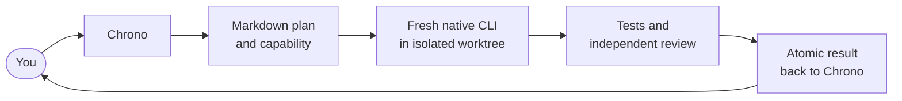

<div align="center">

# Vibe Squad

**One coordinator. Four model families. Sixty-eight specialists, all written in Markdown you can read and edit.**


<br>


*A real dispatch: request in, specialist selected, isolated work completed, result returned.*

</div>

---

Vibe Squad is for people who like **vibe coding** but want more structure than one enormous chat. You talk to **Chrono**, the coordinator. Chrono turns your goal into a plan, picks the specialist and model that fit each part, runs workers in isolated git worktrees, and calls for independent review when the risk warrants it.

You can ask it to:

- "Build a polished landing page, test it in the browser, and show me the result."
- "Research this product idea, compare the competitors, and turn it into a cited brief."
- "Audit this authorized smart-contract target, keep every test in scope, and package only reproduced findings."

The product is the instruction layer, and it is Markdown all the way down. Modes, specialist briefs, capability cards, and skills are files you can open and change. Code handles only what must not be guessed: launching, worktree isolation, identity checks, atomic publication, admission control, and Git-integration boundaries. Judgment stays with the models.

## Quickstart

macOS, for now. You need `tmux`, `fswatch`, `jq`, `curl`, Python 3.13, `uv`, and authenticated native CLIs for Claude, Codex, Gemini, and Kimi.

Memory lives outside the public repository. Create a private vault once:

```bash
mkdir -p "$HOME/Obsidian-Chrono"
printf '%s\n' '{"vault_id":"my-private-vault","schema_version":1}' \
  > "$HOME/Obsidian-Chrono/.chrono-vault"
export CHRONO_VAULT_ROOT="$HOME/Obsidian-Chrono"
```

Then clone and launch:

```bash
git clone https://github.com/mtarcure/claude-vibe-squad.git
cd claude-vibe-squad
uv sync            # create the pinned Python 3.13 environment
bin/squad doctor
bin/squad up
```

That is the whole required path. There is **no background daemon to install first**. `bin/squad up` runs on a fresh clone, notices once that the optional launchd daemon is absent, and continues.

**Optional: the launchd routines.** `bash bin/install-routines.sh --daemon-only` installs a background daemon; `bash bin/install-routines.sh` adds the optional routine agents too. The daemon buys exactly two things: the live `● daemon` segment in the tmux status bar, and the `/summarize` endpoint the weekly review calls. Without it the status bar reads `● daemon offline` and the weekly review writes no narrative. Dispatch, worktree isolation, review, memory, and the coordinator are untouched, because none of them talk to it. See [the daemon guide](docs/install/daemon.md).

`bin/squad up` opens a tmux control room with Chrono and a status window. Each specialist starts as a fresh native CLI process for its task; there are no permanent per-model panes. Detach with `Ctrl-b d`, return with `bin/squad attach`.

`--safe` is not a permission mode. It suppresses the first-run autonomy warning and skips the pre-flight `doctor` check, and that is all. The coordinator and board-spawned workers run with the same permissions either way, because worker launch flags are a fixed controller ABI the supervisor re-derives and refuses to launch on mismatch. Nothing in either path sandboxes later agent actions. A task's `read_scope` and `write_scope` are declarations: `write_scope` is enforced when committed changes are integrated, not while the worker acts, and `read_scope` is not an action-time read barrier. Review the isolated worktree, verification contract, and held-category policy before enabling broader autonomy.

See [Getting started](docs/getting-started.md) for provider authentication, vault setup, and your first request.

## Two modes, one conversation

You ask in plain language. Chrono maps it into exactly one of two workflows.

- **[Project](shared/modes/project.md)** covers software, research, content and media, operations, and learning. Its lifecycle is scope → plan → build → verify → review when required → deliver → remember.
- **[Bounty](shared/modes/bounty.md)** covers authorized offensive-security work: verified scope before hunting, and reproduced, negative-controlled impact evidence before anything is called a finding. Those are rules the mode places on Chrono and the specialists, not a launch interlock; no code blocks a bounty dispatch from starting. The end-of-run verifier refuses to close a run whose manifest does not declare a scope gate, an exact target allowlist with every declared target inside it, and a cross-family reproduction with a hash-bound evidence file per finding. It checks those declarations and the evidence hashes. It does not judge the evidence.

Project and Bounty are the modes. Panels, swarms, and triage are dispatch techniques, not extra modes.

## How it works


```mermaid
flowchart LR
    OP([You]) --> CO[Chrono]
    CO --> PLAN[Markdown plan<br/>and capability]
    PLAN --> RUN[Fresh native CLI<br/>in isolated worktree]
    RUN --> CHECK[Tests and<br/>independent review]
    CHECK --> RESULT[Atomic result<br/>back to Chrono]
    RESULT --> OP
```

1. **Chrono is the only operator-facing voice.** Specialists report to Chrono instead of interrupting you from separate chats.
2. **Routing is quality-first.** Each validated specialist brief is bound to the model profile that fits the job, with a different-family backup and review route.
3. **Workers are isolated.** Mutating attempts get their own git worktree and a narrowly declared write scope.
4. **Results settle atomically.** Artifacts are written before their completion envelope, so partially published work never reads as done.
5. **Consequential authority is denied to ordinary workers.** Authenticated launch authority must keep every held-category token outside the worker's declared `action_scope`, or the supervisor rejects the launch. There is no held-action consent prompt during tool use. Deletion is refused again at Git integration unless a controller-pinned, file-exact manifest authorizes it.

## Specialists and dispatch

Sixty-eight specialist briefs live under `departments/` and `shared/specialists/`, and every one of them validates on each commit. A brief is prose: what the role is for, how it should think, what it must refuse. Adding a specialist means writing Markdown, not registering a class.

Dispatch is a Markdown packet with YAML frontmatter: which specialist, which model, what it may read, what it may write, what counts as done. The packet is the contract. Workers never talk to each other, and never to you. They write one artifact and one completion envelope, and the coordinator integrates the result.

That mailbox shape is deliberate. It is what makes a run reconstructable after the fact, and what lets a failed lane be diagnosed from its packet and receipt rather than from a transcript.

## Memory that compounds

Durable memory is private Markdown outside the repository. Chrono records what a run learned and recalls it before the next one, so a lesson paid for once is not paid for twice.

Recall is ranked retrieval over an FTS5/BM25 index, and it returns more than text: each note carries provenance, a sensitivity tier, and a `disputed` flag set when a later note contradicted it and the two were never reconciled. A contested claim comes back marked as contested rather than quietly winning on recency. Obsidian is an optional human view over the same files.

We are still evaluating explicit Markdown links, bounded graph navigation, and hybrid retrieval against Vibe-Squad-specific questions before adopting any of them. There is no graph database here, and no "SOTA" badge applied on fashion alone.

## Models, tools, and probes

All four families run through their providers' **native CLIs**. Claude, Codex, and Kimi use their supported subscription or managed-login paths. Gemini's native CLI is the explicit API-key-backed exception, with spend and rate controls treated as part of its lane contract. Vibe Squad does not swap a model lane for an MCP relay or a direct API fallback.

Utility services are separate. Memory, research, sequential thinking, security tooling, and media generation may use MCP, local CLIs, or a gated provider API where the capability genuinely needs one.

One rule governs all of it: **a configured tool is not a working tool until a live probe says so.** Declared, delivered, and actual are three different things, and only actual counts.

## Independent review without review theater

Every specialist has a route to a reviewer from another model family. Review is mandatory for security- and judgment-critical work. Ordinary low-risk work does not pretend that every task needs a committee.

The reviewer's job is to find a concrete reason the work is wrong. `REJECT` is a useful result, not a failed run. The machine checks reviewer independence and evidence identity. It does not vote on whether prose, design, or code is good; Chrono and the models still make that call.

Research on model self-correction and heterogeneous verification motivates this design, but no paper validates this exact architecture. We treat that as a hypothesis under test, not a marketing fact.

## Tested, not guessed

Evidence is labeled by what it actually proves.

- **Locally tested:** 1,233 tests cover dispatch, atomic publication, process and receipt fencing, cancellation, cleanup, vault recall, and public-export leak gates. The roster validator checks all 68 specialist briefs on every commit.
- **Live-probed on the maintainer setup:** all four native CLIs have completed bounded probes. Tool availability is lane-specific, and a config entry or a successful `--version` is not liveness.
- **Compared before adoption:** larger policy engines, parallel receipt frameworks, and premature memory-aperture code were prototyped, then removed or deferred when they added more machinery than value.
- **Research-informed:** published work shapes cross-family review and the memory experiments. It is not offered as proof of this implementation.
- **Not yet claimed:** live five-aperture memory enforcement, full legacy-memory migration, automatic failover, and complete fresh-worker tool parity remain open.

That last list should shrink through evidence, not through wording.

## What stays simple

- Change behavior by editing Markdown briefs and capability cards.
- Ask Chrono in ordinary language. You never pick a model by hand.
- Keep private memory, credentials, target data, and runtime state out of the public repository.
- Use deterministic code only for facts that must not be guessed: identity, ordering, hashes, integration scopes, process state, admission denials, file-exact deletion authority.
- Prefer deleting an unused framework over wiring it in because it exists.

The repository carries a large adversarial test suite because process boundaries are easy to get subtly wrong. Those tests are verification, not more product.

## Project status

**v1.1.1** is the first public release. The maintainer installation is an active daily driver, and the release gate behind this tag included a fresh-clone rehearsal, exact-docs checks, native-CLI and tool probes, private-data leak scans, and an independent cross-family skeptic pass that had to re-execute every load-bearing claim rather than read it.

This README describes what is verified today. The **Not yet claimed** items above are real open gates.

Start with the [documentation index](docs/README.md), read the [architecture](docs/architecture.md), or see how to [add a specialist](docs/adding-a-specialist.md).

## Contributing and license

Contributions are welcome. Start with [CONTRIBUTING.md](CONTRIBUTING.md). Keep generated state, mailbox traffic, credentials, private memory, and authorized-target evidence out of commits.

Vibe Squad is licensed under **AGPL-3.0**. See [LICENSE](LICENSE).
