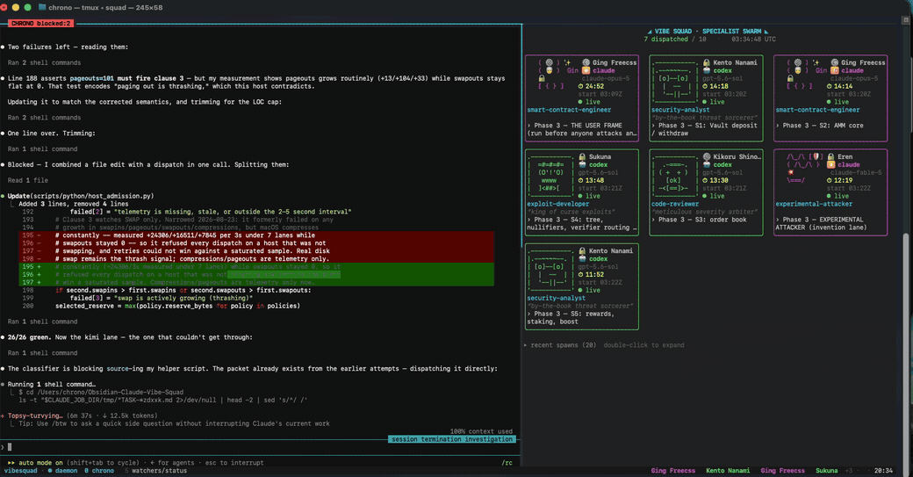
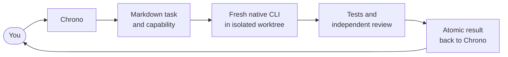

<div align="center">

# Vibe Squad

**One coordinator. Five model families. Seventy-one specialists, all written in Markdown you can read and edit.**


<br>



*Seven specialists live at once across Claude and Codex — each card its own model, profile, elapsed clock and scoped surface — while the coordinator repairs its own admission gate in the pane beside them.*

</div>

---

Vibe Squad is for people who like **vibe coding** but want more structure than one enormous chat. You talk to **Chrono**, the coordinator. Chrono turns your goal into a plan, picks the specialist and model that fit each part, runs workers in isolated git worktrees, and calls for independent review when the risk warrants it.

You can ask it to:

- "Build a polished landing page, test it in the browser, and show me the result."
- "Research this product idea, compare the competitors, and turn it into a cited brief."
- "Audit this authorized smart-contract target, keep every test in scope, and package only reproduced findings."

**What's underneath**

- **The right model for each job** — every specialist is tied to the model that suits its work, not
  to whichever one you happen to be chatting with.
- **Each task runs in its own worktree** — a copy of the repo, with a written list of the files it
  may change, and nothing merges until its checks pass. That list is enforced when changes are
  integrated, not while the worker runs: a worker executes on your host with your permissions, so
  treat this as an autonomy tool, not a containment boundary. See the note under Quickstart.
- **A different model checks the work** — so no model signs off on its own reasoning.
- **It remembers** — what a run learns is written down and read back before the next one, so a
  lesson paid for once isn't paid for twice.

The product is the instruction layer, and it is Markdown all the way down. Modes, specialist briefs, capability cards, and skills are files you can open and change. Code handles only what must not be guessed: launching, worktree isolation, identity checks, atomic publication, admission control, and Git-integration boundaries. Judgment stays with the models.

## Quickstart

macOS, for now. You need `tmux`, `fswatch`, `jq`, `curl`, Python 3.13, `uv`, and authenticated native CLIs for Claude, Codex, Gemini (`agy`), Kimi, and Grok.

Memory lives outside the public repository. Create a private vault once:

```bash
mkdir -p "$HOME/Obsidian-Chrono"
printf '%s\n' '{"vault_id":"my-private-vault","schema_version":1}' \
  > "$HOME/Obsidian-Chrono/.chrono-vault"
export CHRONO_VAULT_ROOT="$HOME/Obsidian-Chrono"
```

Then clone and launch:

```bash
git clone https://github.com/mtarcure/claude-vibe-squad.git
cd claude-vibe-squad
uv sync                                # create the pinned Python 3.13 environment
git config core.hooksPath .githooks    # opt in to the tracked pre-commit checks
bin/squad doctor
bin/squad up
```

That `core.hooksPath` line is the one step nothing does for you. Git only ever runs hooks from
`.git/hooks/`, which no clone receives, so the tracked hook in `.githooks/` stays inert until you
point git at it. Until you do, the specialist, format, and capability checks run on push in CI but
not on your commits — and neither does the private-memory leak guard, which is the check you least
want to discover after a push. It is per-clone local config; undo it with
`git config --unset core.hooksPath`. See [the git hooks guide](docs/git-hooks.md).

That is the whole required path. There is **no background daemon to install first**. `bin/squad up` runs on a fresh clone, notices once that the optional launchd daemon is absent, and continues.

**Optional: the launchd routines.** `bash bin/install-routines.sh --daemon-only` installs a background daemon; `bash bin/install-routines.sh` adds the optional routine agents too. The daemon buys exactly two things: the live `● daemon` segment in the tmux status bar, and the documented `POST /mcp/<server>/<tool>` HTTP bridge. Without it the status bar reads `● daemon offline` and that `curl` path is unavailable; the MCP servers themselves are unaffected. Dispatch, worktree isolation, review, memory, and the coordinator are untouched, because none of them talk to it. See [the daemon guide](docs/install/daemon.md).

`bin/squad up` opens a tmux control room with Chrono and a status window. Each specialist starts as a fresh native CLI process for its task; there are no permanent per-model panes. Detach with `Ctrl-b d`, return with `bin/squad attach`.

`--safe` is not a permission mode. It suppresses the first-run autonomy warning and skips the pre-flight `doctor` check, and that is all. The coordinator and board-spawned workers run with the same permissions either way, because worker launch flags are a fixed controller ABI the supervisor re-derives and refuses to launch on mismatch. Nothing in either path sandboxes later agent actions. A task's `read_scope` and `write_scope` are declarations: `write_scope` is enforced when committed changes are integrated, not while the worker acts, and `read_scope` is not an action-time read barrier. Review the isolated worktree, verification contract, and held-category policy before enabling broader autonomy.

See [Getting started](docs/getting-started.md) for provider authentication, vault setup, and your first request.

## Two modes, one conversation

You ask in plain language. Chrono maps it into exactly one of two workflows.

- **[Project](shared/modes/project.md)** covers software, research, content and media, operations, and learning. Its lifecycle is scope → plan → build → verify → review when required → deliver → remember.
- **[Bounty](shared/modes/bounty.md)** covers authorized offensive-security work: verified scope before hunting, and reproduced, negative-controlled impact evidence before anything is called a finding. Those are rules the mode places on Chrono and the specialists, not a launch interlock; no code blocks a bounty dispatch from starting. The end-of-run verifier refuses to close a run whose manifest does not declare a scope gate, an exact target allowlist with every declared target inside it, and a cross-family reproduction with a hash-bound evidence file per finding. It checks those declarations and the evidence hashes. It does not judge the evidence.

Project and Bounty are the modes. Triage is a dispatch technique, not an extra mode; parallel work is just several independently dispatched single tasks, not a special "panel" or "swarm" transport.


## Dispatch, settlement, and the board


```mermaid
flowchart LR
    OP([You]) --> CO[Chrono]
    CO --> PLAN[Markdown task<br/>and capability]
    PLAN --> RUN[Fresh native CLI<br/>in isolated worktree]
    RUN --> CHECK[Tests and<br/>independent review]
    CHECK --> RESULT[Atomic result<br/>back to Chrono]
    RESULT --> OP
```

**A task is a Markdown file, and that file is the contract.** Which specialist, which model, what it
may read, what it may change, and what counts as done:

```yaml
---
specialist:    security-analyst        # the role, chosen for the job
to_model:      gpt-codex               # the model bound to that role
mode:          project
write_scope:   [src/auth/**]           # the only files it may change
read_scope:    [src/**, docs/auth.md]
reviews:       none                    # or the task id this reviews
review_triggers: [blast_radius]        # what forces a second opinion
---

Audit the session-handling path and report anything exploitable.
Do not change behaviour; findings only.
```

Everything the worker may do is on that page. Workers never talk to each other or to you — each
writes one result and Chrono integrates it.

Four things hold that together:

1. **Chrono is the only operator-facing voice.** Specialists report to Chrono, not to you.
2. **Routing is by fit, not preference.** Each specialist is bound to the model that suits its work,
   with a different-family backup and review route, all in one file:
   [`shared/specialist-runtime-map.tsv`](shared/specialist-runtime-map.tsv).
3. **Workers are isolated and results settle atomically.** Each mutating attempt gets its own git
   worktree and a narrow write scope; artifacts are written before their completion envelope, so
   partially published work never reads as done.
4. **Dangerous actions are refused before a worker starts, not asked about later.** Deleting files,
   changing credentials, publishing — withheld at launch, and deletion refused again at merge unless
   an exact pre-approved file list allows it.

**Review is part of settling, not a separate ceremony.** Every specialist has a route to a reviewer
from another model family, mandatory for security- and judgment-critical work and skipped for
ordinary low-risk work. The reviewer's job is to find a concrete reason the work is wrong; `REJECT`
is a useful result, not a failed run. The machine checks reviewer independence and evidence
identity — it does not vote on whether the work is any good. Which of those rules are actually under
test is written down in a tracked census that names the untested ones too.

**The board carries work across conversations.** Every run leaves its task file and receipt behind,
so a failure is diagnosed from those rather than from a chat log, and something raised but not
finished is picked up next session instead of dying with the thread.

## Memory that compounds

Durable memory is private Markdown outside the repository. Chrono records what a run learned and
recalls it before the next one, so a lesson paid for once is not paid for twice.

Each note carries where it came from and how sensitive it is, and gets flagged when a later note
contradicts it. A contested claim comes back marked contested rather than quietly winning because it
is newer. Obsidian is an optional way to read the same files by hand.

There is no graph database here, and no fashionable label applied for its own sake.

## Specialists, skills, and tools

**71 specialist briefs** live under `departments/` and `shared/specialists/`, each validated on every
push by CI — and on every commit once you enable the tracked pre-commit hook (see the Quickstart; it
is opt-in per clone). A brief is prose: what the role is for, how it should think, what it must
refuse. Adding one means writing Markdown, not registering a class.

```text
71 specialists          claude  ███████████████████████████████  31
                        codex   █████████████████████            21
                        gemini  ████████████████                 16
                        kimi    ██                                2
                        grok    █                                 1
```

Around them sit **99 skills** (methodology documents a specialist reads when the work calls for
it), **six plugins**, and **12 MCP servers** covering memory, research, recon, media, and security
tooling.

All five families run through their providers' **native CLIs** on subscription or managed-login
paths — never swapped for an MCP relay or a direct API fallback. Utility services are separate.

One rule governs all of it: **a configured tool is not a working tool until a live probe says so.**
Declared, delivered, and actual are three different things, and only actual counts. That probe is
[`bin/canary.sh`](bin/canary.sh), which reports **PASS**, **FAIL**, or **NOT MEASURED** — it never
lets "did not run" pass for "works".

The rule earns its keep. A model id can be accepted by the CLI, self-report correctly, and still be
served by a different model; only the usage record shows it. Findings like that are recorded as
dated probes, each with the literal command and its literal result.

## Design principles

- Change behaviour by editing Markdown, not by writing code.
- Ask in ordinary language. You never pick a model by hand.
- Use code only for what must not be guessed: identity, ordering, hashes, what a
  worker may change, and what may be deleted.
- Prefer deleting an unused framework to wiring it in because it exists.
- Keep private memory, credentials, and target data out of the public repository.

## Status

**v1.1.5** is the current release; **v1.1.1** was the first public one. It runs as the maintainer's
daily driver rather than as a demo. [CHANGELOG.md](CHANGELOG.md) records what each release changed,
including the parts that are still rough.

Start with the [documentation index](docs/README.md), the
[architecture](docs/architecture.md), or [how to add a specialist](docs/adding-a-specialist.md).

## Contributing and license

Contributions are welcome. Start with [CONTRIBUTING.md](CONTRIBUTING.md). Keep generated state, mailbox traffic, credentials, private memory, and authorized-target evidence out of commits.

Vibe Squad is licensed under **AGPL-3.0**. See [LICENSE](LICENSE).
