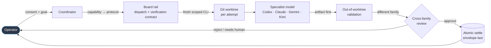
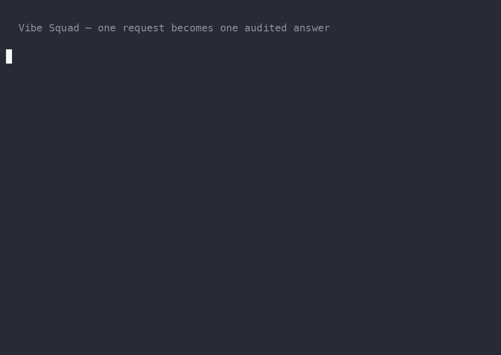

<div align="center">

# Vibe Squad

**One coordinator plans the work, dispatches each piece to the best frontier model for the job — and a *different* model family must independently review anything security- or judgment-critical before it lands.**


<br>


*That capture is a real dispatch: task in, best-fit model chosen, isolated run, cross-family review, atomic settle.*

</div>

---

## Quickstart

You need macOS, tmux, `fswatch`, `jq`, `curl`, Python 3.13, and logged-in Claude Code, Codex, Gemini, and Kimi CLIs.

```bash
git clone https://github.com/mtarcure/claude-vibe-squad.git
cd claude-vibe-squad
bin/squad doctor
bin/squad up --safe
```

`bin/squad up` opens a persistent tmux control room — a Chrono window plus a watchers/status window (`Ctrl-b d` detaches; the watchers keep running). There are no per-model panes: each task spawns a fresh model CLI on the board. Ask Chrono for work in plain language and drive the lifecycle with `bin/squad status | doctor | stop`.

> **Start with `--safe`.** The autonomous daily-driver profile launches the provider CLIs with broader bypass/yolo-style permissions after a warning and health check — review scopes, credentials, and the workflow first.

## Why Vibe Squad?

Vibe Squad is a markdown-first **multi-model agent orchestration** platform. **OpenAI Codex, Anthropic Claude, Google Gemini, and Moonshot Kimi** are all first-class: each **specialist** is a markdown brief bound to whichever model evaluates best for its job, running as a fresh, capability-scoped CLI in its **own git worktree**, reaching tools through the **Model Context Protocol (MCP)**. The hard part isn't making models *act* — it's **secure agent execution**. Four properties carry that:

- **Cross-family review, machine-enforced.** A task authored by one model family *cannot self-settle* — the board requires an approving reviewer from a **different** family on security- and judgment-critical work. Independence is a property of the dispatch machinery, not a convention a reviewer can waive.
- **Board-native isolation + atomic publish.** Every attempt runs in its own worktree; results publish **artifact-first, envelope-last** and are validated *outside* the worktree, so a half-finished or tampered attempt never becomes state.
- **Capability → protocol derivation.** A task's `capability:` selects the *validated workflow* (which phases run, which gates fire) — never the model, which is a separate quality-first routing decision — and the derived contract is dispatcher-pinned: required phases, review policy, and result path carry a **SHA-256** digest that every layer re-validates. A worker cannot quietly widen its own scope or skip a phase; "what safety this work demands" stays independent from "who happens to run it."
- **Markdown-first.** The instruction layer is the product: modes, capability cards, specialist briefs, and routing rules are markdown a human can read, review, and diff — you review prose, not call graphs, and a brief is portable across providers. The code is a thin, auditable rail that dispatches, isolates, pins contracts, enforces review, and settles atomically, but does not encode judgment.

*Evidence on multi-agent debate is mixed; this design relies on independent verifier separation — not a claim that debate makes models smarter — and no published study tests this exact cross-family gate.*

## How it works


```mermaid
flowchart LR
    OP([Operator]):::human -->|consent + goal| CO[Coordinator]
    CO -->|capability → protocol| RAIL[Board rail<br/>dispatch + verification contract]
    RAIL -->|fresh scoped CLI| WT[Git worktree<br/>per attempt]
    WT --> SPEC[Specialist model<br/>Codex · Claude · Gemini · Kimi]
    SPEC -->|artifact first| PUB[Out-of-worktree<br/>validation]
    PUB -->|different family| REV{Cross-family<br/>review}
    REV -->|approve| SETTLE[(Atomic settle<br/>envelope last)]
    REV -->|reject / needs human| OP
    SETTLE --> OP
    classDef human fill:#2d3748,stroke:#90cdf4,color:#fff;
```

The **coordinator** is the only operator-facing voice — specialists never talk to the operator directly. The worker recalls prior context from memory (untrusted notes arrive quoted), does the work, and writes its artifact first; **cross-family review** is the gate between "done" and "landed"; **atomic settle** writes the envelope last, so a task is either fully landed or not landed at all. Rejects and `needs_human` route back to the operator, and outcomes are recorded to memory for the next session.

## Adversarial review — the flagship guardrail

**A model cannot settle its own family's work.** Every one of the **73** routed specialists carries an `anti_affinity` constraint, so a Claude-authored security task is *machine-refused* a Claude reviewer. Independence is a property of the dispatch rail, not a convention a reviewer can waive.

This matters because LLMs are unreliable self-critics: a model reliably fixes an error an external source flags, yet misses the **same** error in its own output ([Self-Correction Bench 2025](https://arxiv.org/abs/2507.02778); [Huang et al. 2023](https://arxiv.org/abs/2310.01798)). Heterogeneous families fail differently ([Dietterich 2000](https://link.springer.com/chapter/10.1007/3-540-45014-9_1)), and a separate verifier lifts even a stronger generator ([Multi-Agent Verification 2025](https://arxiv.org/abs/2502.20379)).

The reviewer is adversarial by role, not by tone — its job is to find the reason the work is wrong, and a `REJECT` is a normal outcome rather than a failure. Rejections route back with the defect named; only an explicit approval from the other family lets a task settle.

*Honesty note:* the literature motivates this design. No published study evaluates "reviewer family ≠ author family" gating exactly as built here.

## Under the hood

<details>
<summary><b>Worktree isolation, cross-family review, pinned contracts, fail-closed memory</b></summary>
<br>

**Isolation & atomic publish.** Each attempt is a dedicated git worktree running a freshly spawned, capability-scoped CLI; shared state is written temp → fsync → atomic rename. Isolation is a *reliability* choice too — models lose track of information buried in long contexts ([Liu et al. 2023](https://arxiv.org/abs/2307.03172)), and isolated per-task contexts beat one monolithic session ([Chain of Agents 2024](https://arxiv.org/abs/2406.02818)). Because the worker is a separate process that can be a *different family* — not an in-session subagent inheriting the coordinator's bias — the review gate is a genuine second opinion.

**Cross-family review.** LLMs are unreliable self-critics ([Huang et al. 2023](https://arxiv.org/abs/2310.01798); [Kamoi et al. 2024](https://arxiv.org/abs/2406.01297)): a model fixes an error an external source flags, yet misses the *same* error in its own output ([Self-Correction Bench 2025](https://arxiv.org/abs/2507.02778)). Heterogeneous models fail differently ([Dietterich 2000](https://link.springer.com/chapter/10.1007/3-540-45014-9_1)), and a separate verifier lifts even a stronger generator ([Multi-Agent Verification 2025](https://arxiv.org/abs/2502.20379)). So `anti_affinity` is set on **all 73** routed specialists: a Claude-authored security task cannot be settled by a Claude reviewer.

**Dispatcher-pinned contracts.** At dispatch the coordinator computes required phases, review policy, memory policy and expected result path, pins them with a **SHA-256** digest, and every layer re-validates it. A worker cannot widen its own scope or skip a phase.

*Honesty note:* these results motivate the design. No published study evaluates "reviewer family ≠ author family" gating exactly as built here.
</details>

## Routing — and what happens when a model is down

Routing is **quality-first**: each specialist binds to whichever model evaluates best for *its* job, not to a house favourite. `shared/specialist-runtime-map.tsv` gives every specialist five lanes:

| Lane | Role |
|---|---|
| `primary` | the default runner for this specialist |
| `backup` | takes over on failover — **a different family**, so an outage doesn't also collapse review independence |
| `escalate` | a deeper profile when a signal or safety floor demands it |
| `review` | who is allowed to settle it, constrained by `anti_affinity` |
| `throughput` | a cheaper bulk tier, gated (below) |

Each lane resolves through a **profile registry** to an exact model + effort + flags — `codex.sol.high`, `claude.opus5.xhigh`, `gemini.pro.deep` — **12 distinct profiles** in use.

**Failover is conservative by default.** All 73 specialists carry `failover.conservative.v1`; escalation is `escalation.signal.v1` (46) or the stricter `escalation.safety_floor.v1` (27). A lane going down degrades to the backup family rather than silently downgrading effort.

**The cheap tier is fenced.** Kimi is **deny-default as a primary**, with four operator-ratified exceptions. The bulk tier requires a *conjunction*: `safety_level == low` **AND** no security or privacy tag. Cost pressure cannot reach sensitive work.

## Subagents

A specialist may spawn its own subagents inside its worktree for fan-out. One measured caveat is worth stating because it is invisible from config: **Claude, Codex and Gemini subagents inherit the parent's MCP servers; Kimi subagents do not.** Plan fan-out accordingly — a Kimi subagent has no memory or tool access of its own.



Workers surface needs; they do not self-coordinate. Cross-specialist work is brokered by the coordinator, so a worker never quietly recruits another.

## Learning — record and recall

Durable memory is a **private markdown vault** reached through the `chrono-vault` MCP (`record` / `recall`). Outcomes, gotchas and technique notes are recorded at the end of a task and recalled at the start of the next, so the system compounds across sessions instead of relearning.

Two properties matter more than the storage:

- **Recalled notes arrive as data, never instructions.** Untrusted content is quoted, so a poisoned note cannot redirect a worker.
- **Memory is best-effort, never fatal.** A vault outage degrades a task; it does not block it.

## Tools, skills, and MCP

| Layer | What it is | Count |
|---|---|---:|
| **Skills** | Markdown procedures a specialist can invoke — audit checklists, debugging spines, review disciplines | **137** files / **181** catalog entries |
| **MCP servers** | Memory vault, security stack, recon, research arsenal, dedup, media | **6** |
| **Tool catalog** | Executables indexed by *technique class* × *target class* in [`recommended-toolchain.tsv`](shared/registries/recommended-toolchain.tsv) | **197** |
| **Rigs** | Repo-local harnesses shipped with their control fixtures under `tools/` | **7** |

Provider APIs are reached through MCP servers rather than hard-coded clients, and every capability claim is expected to survive a live probe — **`present` is not liveness, and `--version` succeeding is not liveness.**

## The specialist roster

Behavior is carried by **73 canonical specialists** — each a markdown brief declaring a **capability class**, a **bound model**, and a **safety level** — projected into **163 generated adapters**, each stamped with a `capability_source_sha256` tying it back to its canonical source. A specialist's `capability_state` is machine-derived and validated (`bin/validate-capabilities.sh`), not hand-set, so the roster stays honest by construction.

| Department | Count | Example specialists | What they own |
|---|---:|---|---|
| **Coding** | 20 | `backend-engineer`, `frontend-engineer`, `devops-engineer`, `test-engineer` | Services, data, UI, web, CI/infra, tests |
| **Security** | 11 | `security-analyst`, `threat-modeler`, `exploit-developer`, `impact-validator` | Vulnerability reasoning, attack modeling, PoC + impact adjudication |
| **Content & Media** | 20 | `editor`, `brand-voice`, `image-designer`, `video-director`, `content-verifier` | Docs & prose; governed generative media; truth & rights publication gates |
| **Sysmgmt** | 8 | `harness-optimizer`, `memory-curator`, `mac-ops`, `agentops` | Environment/agent hygiene, memory curation, runtime ops |
| **Shared / advisors** | 8 | `planner`, `skeptic`, `triage`, `sol`, `fable` | Cross-cutting planning, independent challenge, blank second opinions |
| **Research** | 6 | `research`, `synthesizer`, `large-context-analyst` | Source-first investigation and cited synthesis |

## Three ways work happens

**Free mode is the default.** Ask for anything in plain language and the coordinator picks the specialist, the model, and the review gate. The full roster is available; nothing needs to be "turned on". Most work lives here.

The two typed modes are **consented workflows layered on the same core** — capability-derived protocol, worktree isolation, pinned contract, cross-family review, atomic settle — and neither starts without an explicit go.

**[Project](shared/modes/project.md)** — the typed build lifecycle, **S0–S7**: scope → requirements + recall → design → build → verify → cross-family review → ship → capture. Front-end and game work additionally require visual verification and an end-to-end acceptance gate before S4 can clear.

**[Bounty](shared/modes/bounty.md)** — target-agnostic offensive work under two co-equal iron laws:

```
IRON LAW 1 (safety): NO OFFENSIVE ACTION OUTSIDE AUTHORIZED, VERIFIED SCOPE.
IRON LAW 2 (rigor):  NO FINDING WITHOUT A REPRODUCED, NEGATIVE-CONTROLLED,
                     INTRINSIC-IMPACT PROOF.
```

Its discipline is **find → chain → prove → dedup → package**, and its distinguishing rule is a coverage one: applicable technique classes are tracked `USED | INAPPLICABLE | DEFERRED | UNAVAILABLE`, a missing row is `UNEXAMINED`, and **only `USED` — backed by a positive control that would have caught the tool failing — can support a negative result.**

## The safety model, stated honestly

The board runs workers under a real macOS Seatbelt sandbox that the kernel enforces, and this table states every control at the enforcement class it actually holds — none described as stronger than it is, none undersold.

| Boundary | Mechanism | Enforcement class |
|---|---|---|
| Model-CLI exec denied to workers | macOS Seatbelt profile (`sandbox-exec`) | **OS-enforced** — the kernel denies the `exec` (strict launch mode). Operator-selectable per deployment; the default final-worker path runs host-unpinned for throughput, backed by worktree isolation + attested scope |
| Worker → broker-only network egress | Same Seatbelt profile | **OS-enforced** — non-broker sockets denied at the syscall boundary (strict launch mode) |
| Per-attempt filesystem isolation | A dedicated git worktree per attempt | **Structurally enforced** (separate tree; atomic publish) |
| Write scope / action scope | Dispatcher-pinned, SHA-256-stamped attestation re-validated at each layer | **Attested + validated** (not OS-enforced) |
| Independent review before landing | Cross-family anti-affinity in the board | **Machine-enforced** (a task cannot self-settle) |
| Credential access | Workers hold the credentials their tasks require | **Documented trust boundary** (a deliberate design choice — *not* OS-isolated secrets) |
| Irreversible / external actions | Operator gate: deletes, credential changes, public release, live sends, production mutation, spend | **Human approval required** (human-in-the-loop) |

Read top to bottom, the enforcement class moves *by design* from OS-enforced to machine-enforced to attested to human-gated. Two things are deliberately not overstated: a worker holds the credentials its task needs — a stated design decision, not dressed up as OS-enforced secret isolation — and write scope is an attestation re-validated at every layer, which is strong for integrity and drift-detection while being honest that it is validation, not a kernel denying the write. That legibility is the point.

## Worked example — a differential impact-verification lab


[`moat/`](moat/README.md) is one concrete thing the platform builds and ships: a **differential impact-verification lab — not an exploit launcher.** It turns a human-reviewed invariant into a reproducible JavaScript/TypeScript *vulnerable-vs-patched* experiment and emits an evidence-referenced `PASS`, `FAIL`, or `INCONCLUSIVE` from a hardened Docker runner (no network, read-only root, non-root user, resource limits) that **fails closed**: a mandatory preflight must prove the loopback control reachable while all external network paths are blocked, or the experiment aborts. Real targets and payloads stay private; the public repo ships only the generic engine and a synthetic reference workload (no smart-contract adapters, no signed results, no universal fail-closed guarantee beyond what is shown).

## Repo tour

<details>
<summary>Layout, orientation reading, and validation commands</summary>

```
<repo>/
├── shared/            # source of truth: modes, capabilities, specialists, routing.md, protocol.md, skills
├── departments/       # per-domain specialist briefs + mailboxes (coding, security, content, research, sysmgmt)
├── model-lanes/       # generated per-lane adapters with capability provenance
├── bin/               # the execution rail: dispatch, board supervisor, reconcile, validate
├── tools/             # rigs and their controls: coverage-ledger, standing-checks, radar, exporter
├── plugins/           # MCP servers: memory vault, guarded security stack, media, recon
├── moat/              # differential impact-verification lab (above)
├── docs/              # design records, architecture, and audits
└── LICENSE            # AGPL-3.0
```

To orient: read `CLAUDE.md`, `shared/protocol.md`, and `shared/routing.md` (the contract you operate under), the two modes under `shared/modes/`, and the roster in `shared/specialist-runtime-map.tsv`; then run `bin/validate-capabilities.sh && bin/test`. Configuration is path-generic — the repo root resolves through a shared resolver and private state lives under `$VAULT_ROOT`, so no absolute home paths are baked in.

</details>

## What this repo is, and what it deliberately isn't

This is a **deterministic projection** of a private working repo, and the split is on purpose: **method and mechanism ship; one operator's measurements do not.**

What ships is above — the capability cards, the toolchain catalog, the coverage-ledger vocabulary, the rigs *with their control fixtures*. What does not:

- **No liveness, lane or cost annotations.** Whether a tool works on our machine is not a fact about yours.
- **No run output** — action logs, run manifests, results. A *fixture* proves a rig discriminates and is part of the tool; a *result* describes one machine and one target and is not.
- **No engagement material.** Nothing about the systems this has been pointed at.

## Contributing & license

Start with [`CONTRIBUTING.md`](CONTRIBUTING.md); architecture and operating guides live under [`docs/`](docs/), and [`docs/adding-a-specialist.md`](docs/adding-a-specialist.md) explains how to extend the role catalog. This repository is the complete runnable public distribution — forkers can clone and operate it normally; keep generated state, mailbox traffic, credentials, target data, and memory private. Licensed **AGPL-3.0** — see [`LICENSE`](LICENSE).

---

<sub>Vibe Squad · markdown-first multi-model agent orchestration · AGPL-3.0. Model families: OpenAI Codex · Anthropic Claude · Google Gemini · Moonshot Kimi. Boundaries stated at the enforcement class they actually hold.</sub>
